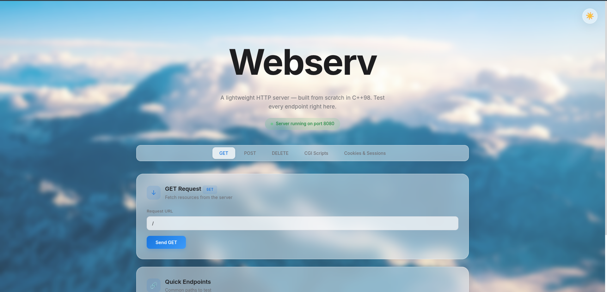
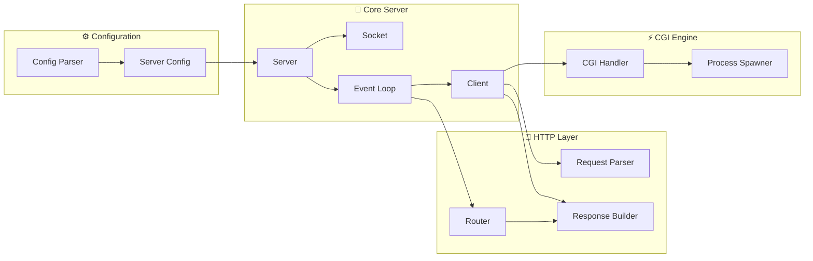

<div align="center">

# 🌐 Webserv

**A high-performance, non-blocking HTTP/1.1 web server built from scratch in C++**

[](https://isocpp.org/)
[](https://www.kernel.org/)
[](Makefile)
[](https://42.fr)

*This is when you finally understand why URLs start with HTTP*

</div>

---

## About

Webserv is a fully functional HTTP/1.1 web server written in C++98 using raw POSIX sockets and kernel-level I/O multiplexing. It handles real browser traffic, executes CGI scripts (Python & PHP), manages file uploads, and supports virtual hosting — all within a **single-threaded, event-driven architecture** inspired by NGINX.

> Built as part of the [42 Network](https://42.fr) curriculum, this project demonstrates systems-level programming with a focus on non-blocking I/O, process management, and protocol compliance.

---

## Demo




> Open **http://localhost:8080** in your browser to access the interactive dashboard, where you can test every endpoint — GET requests, POST uploads, DELETE operations, and CGI script execution.

---

## Features

| Category | Feature |
|----------|---------|
| **Networking** | Non-blocking I/O with kernel-level multiplexing for thousands of concurrent connections |
| **HTTP/1.1** | Full support for `GET`, `POST`, `DELETE` with persistent connections (keep-alive) |
| **CGI** | Execute Python and PHP scripts with non-blocking process management |
| **Streaming** | Chunked Transfer Encoding for real-time CGI output streaming |
| **Virtual Hosting** | Multiple server blocks with hostname-based routing on shared ports |
| **File Management** | Upload, download, and delete files with configurable storage directories |
| **Directory Listing** | Auto-generated HTML directory index with `autoindex` |
| **Redirections** | Configurable HTTP `301`/`302` redirects per location |
| **Error Handling** | Custom error pages per server block (`404`, `500`, etc.) |
| **Resilience** | Automatic timeout cleanup for idle clients and zombie CGI processes |
| **Shutdown** | Graceful signal handling (`Ctrl+C`) with clean resource deallocation |
| **Configuration** | NGINX-inspired `server { }` / `location { }` block syntax |

---

## Quick Start

### Prerequisites

- **Linux** (requires kernel-level I/O multiplexing)
- **g++** with C++98 support
- **Python 3** and/or **PHP-CGI** (for CGI scripts)

### Build & Run

```bash
# Clone the repository
git clone https://github.com/aziddineelm/Webserv.git
cd Webserv

# Compile
make

# Run with default configuration
./webserv

# Or specify a custom config file
./webserv config/default.conf
```

Then open **http://localhost:8080** in your browser.

---

## Stress Testing

Tested with [Siege](https://www.joedog.org/siege-home/) — an HTTP load testing tool — simulating **250 concurrent users** sending **250 requests each** (62,500 total connections):

```bash
siege -c 250 -r 250 http://localhost:8080/
```

| Metric | Result |
|--------|--------|
| **Total Transactions** | 250,000 hits |
| **Availability** | **100.00%** |
| **Failed Transactions** | **0** |
| **Transaction Rate** | 4,266 trans/sec |
| **Throughput** | 64.82 MB/sec |
| **Avg Response Time** | 56 ms |
| **Concurrency** | 239.73 |

> Zero failed transactions under heavy concurrent load — achieved through non-blocking I/O multiplexing and an efficient single-threaded event loop.

---

## Configuration

The server uses an NGINX-inspired configuration file. Here is an example:

```nginx
server {
    listen 8080;
    server_name localhost;
    root www;
    index index.html;
    client_max_body_size 100M;

    error_page 404 /pages/errors/404.html;

    location / {
        allowed_methods GET POST;
        autoindex off;
    }

    location /uploads {
        upload_store www/uploads;
        allowed_methods GET POST DELETE;
        autoindex on;
    }

    location /cgi-bin {
        root www/cgi-bin;
        allowed_methods GET POST;
        cgi_extension .py;
        cgi_path /usr/bin/python3;
    }

    location /redirect {
        return 301 https://example.com;
    }
}
```

| Directive | Description |
|-----------|------------|
| `listen` | Port number to bind to |
| `server_name` | Hostname for virtual host matching |
| `root` | Document root directory |
| `index` | Default file for directory requests |
| `client_max_body_size` | Maximum request body size |
| `error_page` | Custom error page mapping |
| `allowed_methods` | Permitted HTTP methods per location |
| `autoindex` | Enable/disable directory listing |
| `upload_store` | Target directory for file uploads |
| `cgi_extension` / `cgi_path` | Map file extensions to CGI interpreters |
| `return` | HTTP redirect with status code and URL |

---

## Architecture

The server follows a **single-threaded, event-driven** model. All network I/O, HTTP processing, and CGI communication are handled asynchronously — no threads, no blocking.



For in-depth technical documentation, see the **[docs/](docs/)** directory.

---

## Project Structure

```
Webserv/
├── srcs/
│   ├── main.cpp                 # Entry point & signal setup
│   ├── server/                  # Core server infrastructure
│   │   ├── Server.cpp/hpp       #   Server orchestrator
│   │   ├── Socket.cpp/hpp       #   RAII socket wrapper
│   │   ├── EventLoop.cpp/hpp    #   Event-driven I/O loop
│   │   └── Client.hpp           #   Per-connection state machine
│   ├── http/                    # HTTP protocol layer
│   │   ├── request/             #   Streaming request parser
│   │   ├── response/            #   Chunked response builder
│   │   └── router/              #   Virtual host & location routing
│   ├── config/                  # Configuration
│   │   ├── ConfigParser.cpp/hpp #   Config file parser
│   │   └── ServerConfig.cpp/hpp #   Server & location structs
│   └── cgi/                     # CGI execution
│       ├── CGIHandler.cpp/hpp   #   Non-blocking CGI manager
│       ├── ProcessSpawner.hpp   #   Process creation wrapper
│       └── EnvBuilder.hpp       #   Environment variable builder
├── config/                      # Configuration files
│   └── default.conf
├── www/                         # Web root
│   ├── index.html               #   Interactive dashboard
│   ├── cgi-bin/                 #   CGI scripts (Python & PHP)
│   ├── pages/                   #   Static & error pages
│   └── uploads/                 #   Upload directory
├── tests/                       # Test suite
│   ├── test_webserv.py          #   Automated HTTP tests
│   └── valgrind_check.py        #   Memory leak detection
├── docs/                        # Technical documentation
└── Makefile
```

---

## Team

| Module | Owner | Description | Docs |
|--------|-------|-------------|------|
| **Core Server** | **DKOK01** | Event-driven I/O loop, socket management, connection lifecycle, CGI integration, timeout management | [EventLoop Architecture](docs/architecture_eventloop.md) |
| **HTTP Protocol** | **aziddine** | Request parsing, response building, routing, virtual hosting, file streaming | [HTTP Architecture](docs/architecture_http.md) |
| **CGI & Config** | **anbaya** | CGI process management, configuration parsing, environment builder | [CGI Architecture](docs/architecture_cgi.md) |

---

## Testing

```bash
# Run automated HTTP test suite
python3 tests/test_webserv.py

# Memory leak check with Valgrind
python3 tests/valgrind_check.py

# Stress test with Siege
siege -c 250 -r 250 http://localhost:8080/
```

---

## License

This project was developed as part of the [42 school](https://42.fr) curriculum.
