# Webserv — Ultimate Evaluation Defense Guide (Person A)

> [!IMPORTANT]
> This guide covers **everything** you need to explain during evaluation: architecture, kernel concepts, code walkthrough with exact line numbers, cross-team integration, and scripted answers for tough evaluator questions.

---

## Table of Contents

1. [Full Project Class Map](#1-full-project-class-map)
2. [Startup Sequence: `main()` → First `epoll_wait()`](#2-startup-sequence)
3. [The Kernel Engine: Why `epoll` Beats `poll`/`select`](#3-the-kernel-engine)
4. [Socket Initialization Deep-Dive](#4-socket-initialization)
5. [The Event Loop: Complete Lifecycle Flowchart](#5-the-event-loop)
6. [Client State Machine & Buffer Management](#6-client-state-machine)
7. [Non-Blocking CGI Pipeline](#7-non-blocking-cgi-pipeline)
8. [Cross-Team Integration: How A ↔ B ↔ C Connect](#8-cross-team-integration)
9. [FD Ownership & Leak Prevention Model](#9-fd-ownership-model)
10. [Signal Handling & Graceful Shutdown](#10-signal-handling)
11. [Evaluator Q&A Scripts (12 Questions)](#11-evaluator-qa-scripts)
12. [Quick-Reference Cheat Sheet](#12-cheat-sheet)

---

## 1. Full Project Class Map

This is the **complete class hierarchy** of the entire Webserv project. During evaluation, use this to show you understand how all three team members' code fits together.

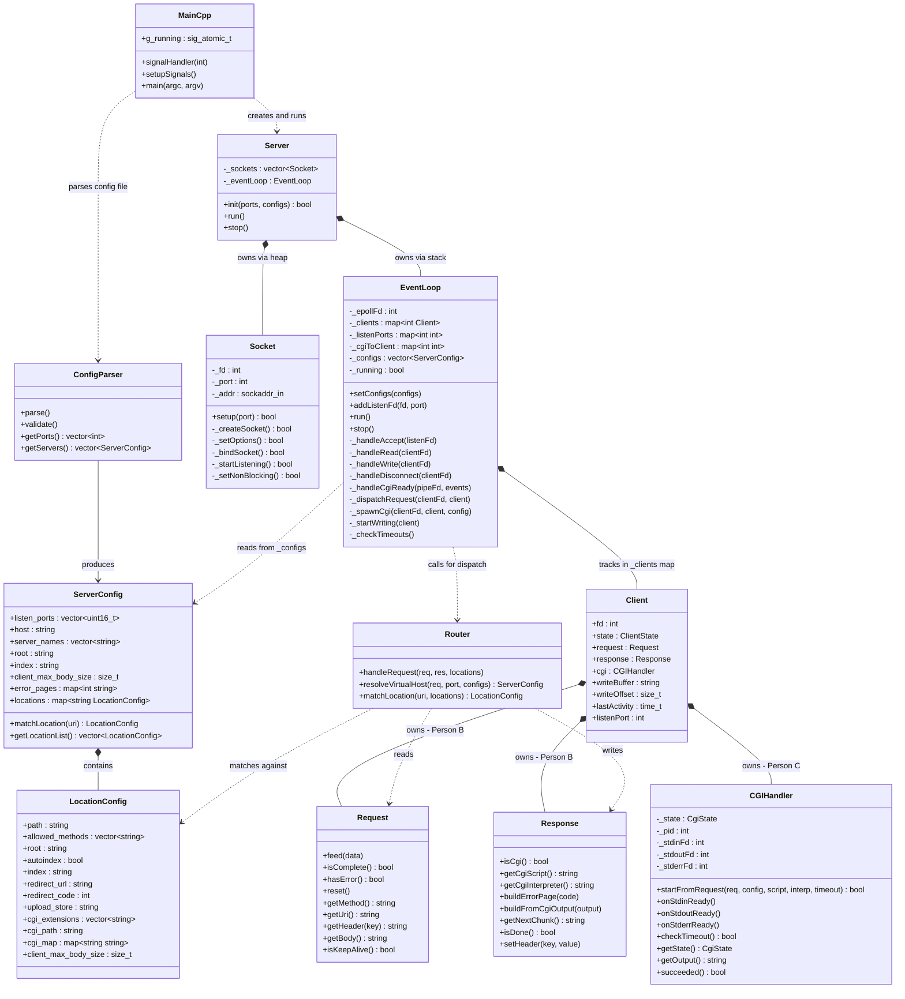

> [!NOTE]
> **Color coding by person:** `Server`, `Socket`, `EventLoop`, `Client` = **Person A** (you). `Request`, `Response`, `Router` = **Person B**. `ConfigParser`, `ServerConfig`, `CGIHandler` = **Person C**. The `Client` struct is the glue — it holds one instance of each person's core object.

---

## 2. Startup Sequence

This traces the exact order of operations from `./webserv config/default.conf` to the first `epoll_wait()` call.

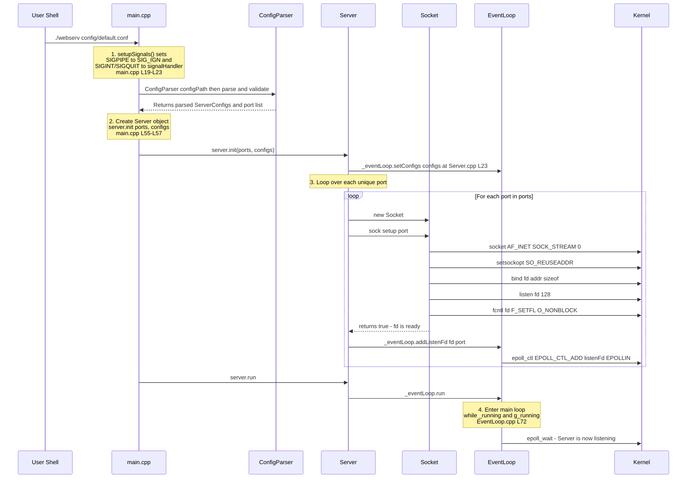

**Key files:** [main.cpp](file:///home/aysadeq/Desktop/Webserv/srcs/main.cpp) → [Server.cpp:L22-L49](file:///home/aysadeq/Desktop/Webserv/srcs/server/Server.cpp#L22-L49) → [Socket.cpp:L30-L47](file:///home/aysadeq/Desktop/Webserv/srcs/server/Socket.cpp#L30-L47) → [EventLoop.cpp:L64-L121](file:///home/aysadeq/Desktop/Webserv/srcs/server/EventLoop.cpp#L64-L121)

---

## 3. The Kernel Engine

````carousel
### Why `epoll` Over `poll` / `select`?

| Feature | `select()` | `poll()` | `epoll()` |
|---------|-----------|---------|----------|
| **Complexity per call** | $O(N)$ — scans all FDs | $O(N)$ — scans all FDs | $O(1)$ — returns only ready FDs |
| **FD limit** | 1024 (FD_SETSIZE) | No hard limit | No hard limit |
| **FD registration** | Rebuild `fd_set` every loop | Rebuild `pollfd[]` every loop | Register once with `epoll_ctl` |
| **Kernel mechanism** | Linear scan | Linear scan | Red-Black Tree + Ready List |
| **Scales to** | ~hundreds | ~thousands | ~millions |

**Why this matters for `webserv`:** Under `siege -c 100` stress testing, `poll()` would scan 100+ FDs every single loop iteration. `epoll` only wakes up and returns the exact 2-3 FDs that actually have data ready.
<!-- slide -->
### How `epoll` Works Inside the Kernel

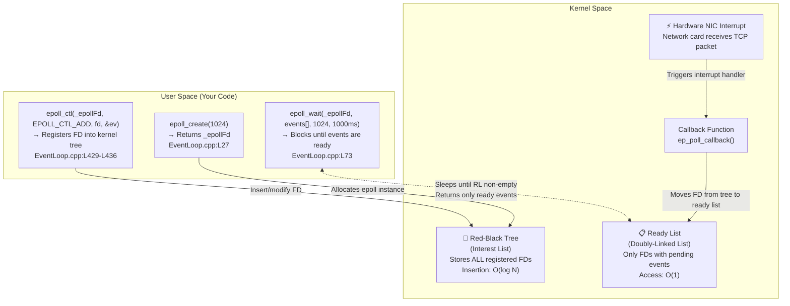

**The key insight:** When data arrives on a socket, the kernel's network card triggers a hardware interrupt. The interrupt handler calls `ep_poll_callback()` which moves that specific FD from the Red-Black Tree to the Ready List. When `epoll_wait()` returns, it copies only the Ready List entries to your `events[]` array. Zero scanning.
<!-- slide -->
### The Three `epoll` Syscalls in Your Code

| Syscall | What It Does | Your Code |
|---------|-------------|-----------|
| `epoll_create(1024)` | Creates the epoll instance (the size hint is ignored in modern Linux but required in the API) | [EventLoop.cpp:L27](file:///home/aysadeq/Desktop/Webserv/srcs/server/EventLoop.cpp#L27) |
| `epoll_ctl(EPOLL_CTL_ADD)` | Register a new FD to monitor | [_addEpollFd()](file:///home/aysadeq/Desktop/Webserv/srcs/server/EventLoop.cpp#L429-L436) |
| `epoll_ctl(EPOLL_CTL_MOD)` | Switch between `EPOLLIN` ↔ `EPOLLOUT` | [_setEpollEvents()](file:///home/aysadeq/Desktop/Webserv/srcs/server/EventLoop.cpp#L448-L455) |
| `epoll_ctl(EPOLL_CTL_DEL)` | Remove FD from monitoring | [_removeEpollFd()](file:///home/aysadeq/Desktop/Webserv/srcs/server/EventLoop.cpp#L438-L446) |
| `epoll_wait(...)` | Block until events are ready (or timeout) | [EventLoop.cpp:L73](file:///home/aysadeq/Desktop/Webserv/srcs/server/EventLoop.cpp#L73) |

**Level-Triggered (default):** Your code uses Level-Triggered mode (not Edge-Triggered). This means `epoll_wait()` will keep reporting a FD as ready as long as there is data in the buffer. This is safer and simpler — you don't need to drain every byte in a single call.
````

---

## 4. Socket Initialization

Every listening socket goes through exactly 5 syscalls. If any fails, the FD is immediately closed (RAII-style cleanup):

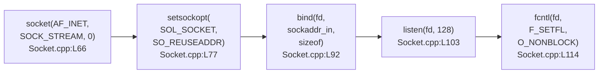

| Syscall | Purpose | What Happens If Missing |
|---------|---------|----------------------|
| `socket()` | Creates a TCP endpoint (IPv4, stream-based) | No network communication possible |
| `setsockopt(SO_REUSEADDR)` | Allow immediate rebind after restart (skip `TIME_WAIT`) | *"Address already in use"* error when restarting server |
| `bind()` | Associates socket with `0.0.0.0:port` — `htonl(INADDR_ANY)` binds to all interfaces | Socket exists but isn't attached to any network address |
| `listen(fd, 128)` | Marks socket as passive (accepting connections). Backlog=128 means kernel queues up to 128 pending `SYN` handshakes | `accept()` would fail — socket isn't in listening state |
| `fcntl(O_NONBLOCK)` | Makes `accept()` return `EAGAIN` instead of blocking when no connections pending | `accept()` on listener blocks entire server |

---

## 5. The Event Loop

This is the **complete flowchart** of [EventLoop::run()](file:///home/aysadeq/Desktop/Webserv/srcs/server/EventLoop.cpp#L64-L121) — the heart of your server. Every line maps to real code:

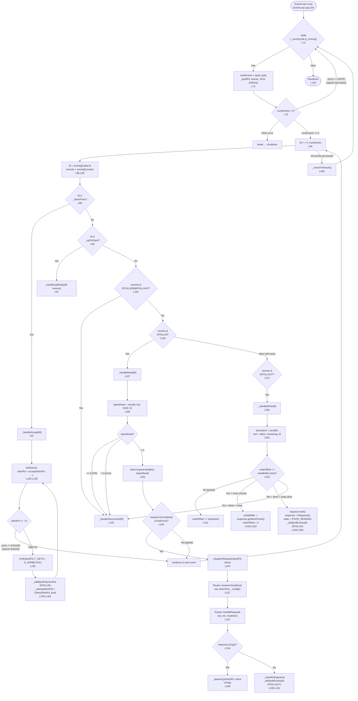

---

## 6. Client State Machine

Each client connection is tracked by a [Client](file:///home/aysadeq/Desktop/Webserv/srcs/server/Client.hpp) struct with 4 possible states defined in the [ClientState](file:///home/aysadeq/Desktop/Webserv/srcs/server/Client.hpp#L14-L19) enum:

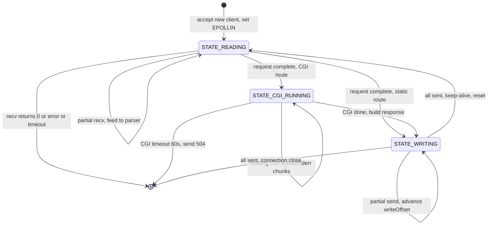

### Buffer Management: Why Partial I/O Works

```
 Client struct (per connection)
 ┌─────────────────────────────────────────────────────────────┐
 │ fd = 7                                                      │
 │ listenPort = 8080                                           │
 │ state = STATE_WRITING                                       │
 │ lastActivity = 1752659145                                   │
 │                                                             │
 │ request (Person B):                                         │
 │   ┌─ _buffer: accumulated raw bytes from recv() calls       │
 │   ├─ _state: REQUEST_LINE → HEADERS → BODY → COMPLETE      │
 │   └─ feed(): appends new data, advances parser state        │
 │                                                             │
 │ response (Person B):                                        │
 │   ┌─ getNextChunk(): returns next piece of response         │
 │   └─ isDone(): true when all chunks sent                    │
 │                                                             │
 │ writeBuffer = "HTTP/1.1 200 OK\r\n..."  ← current chunk    │
 │ writeOffset = 4096  ← bytes already sent from this chunk    │
 │              ▲                                              │
 │              │ send() returned 4096 on the last EPOLLOUT    │
 │              │ Next send() starts from writeBuffer + 4096   │
 │                                                             │
 │ cgi (Person C):                                             │
 │   ┌─ _stdinFd / _stdoutFd / _stderrFd: pipe endpoints      │
 │   ├─ _pid: child process PID                                │
 │   └─ _state: CGI_IDLE → CGI_WRITING → CGI_READING → CGI_DONE│
 └─────────────────────────────────────────────────────────────┘
```

---

## 7. Non-Blocking CGI Pipeline

This is the most complex part of Person A's code. The key insight: **CGI pipe FDs are registered into the same `epoll` instance as client sockets**, so the event loop never blocks waiting for a CGI script.

````carousel
### Step 1: Spawning the CGI Process

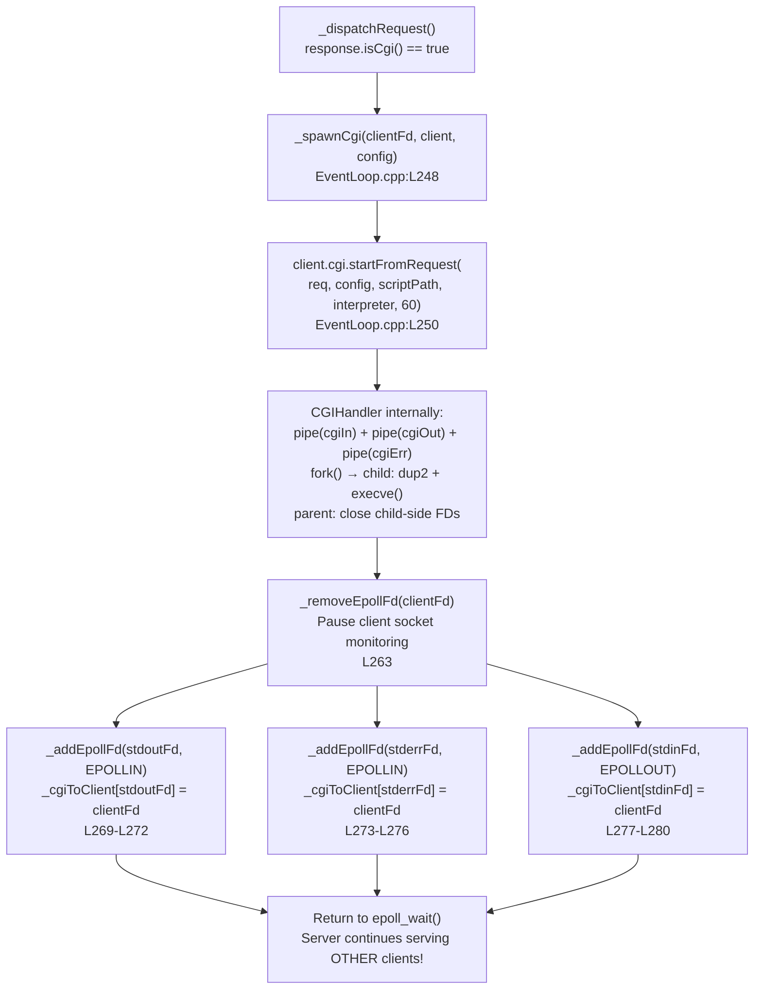
<!-- slide -->
### Step 2: Processing CGI I/O Events

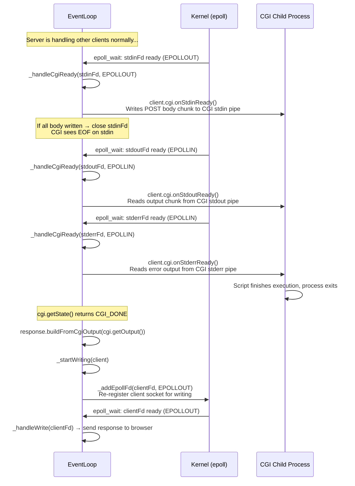
<!-- slide -->
### Step 3: CGI Timeout Handling (504 Gateway Timeout)

If a CGI script hangs (infinite loop, deadlock), `_checkTimeouts()` catches it:

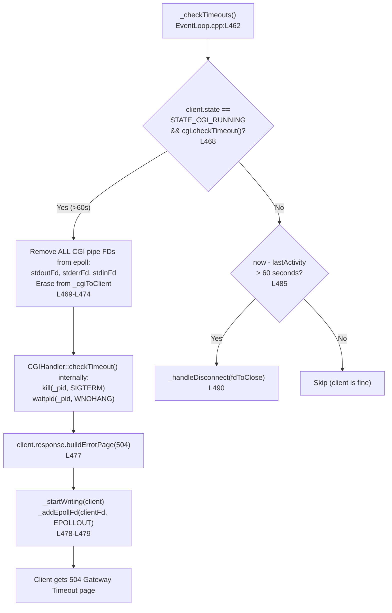
````

---

## 8. Cross-Team Integration

This shows exactly **where Person A's code calls Person B's and Person C's code**, and what data flows between them:

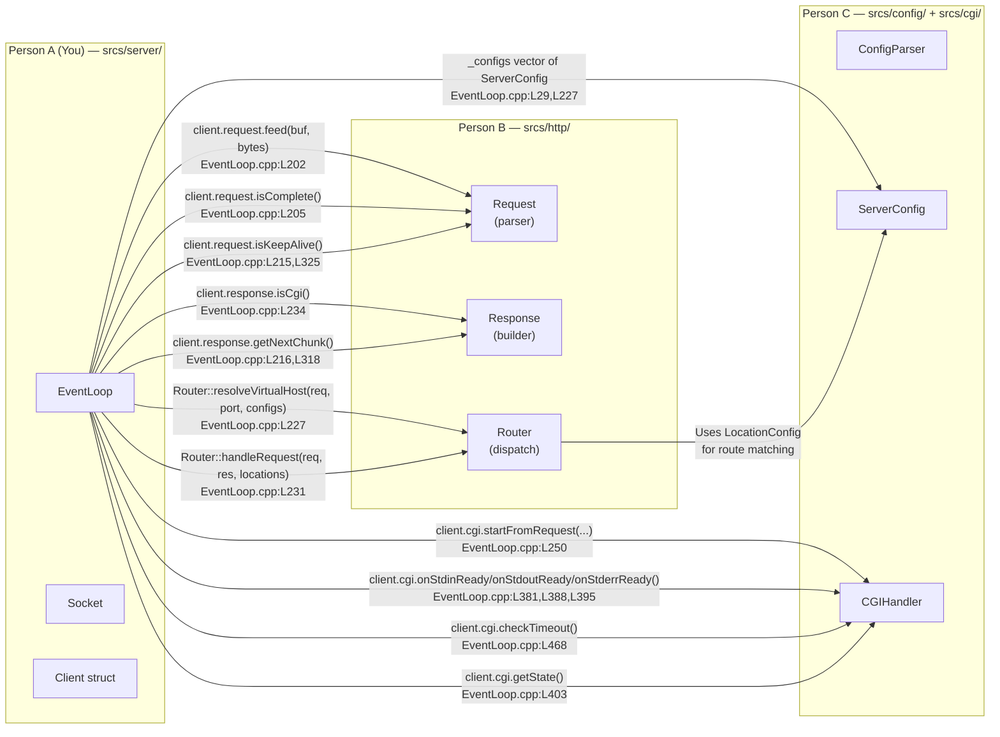

### Integration Contract Summary

| When Person A calls... | What it expects back | Where |
|---|---|---|
| `request.feed(data)` | Parser accumulates bytes internally | [L202](file:///home/aysadeq/Desktop/Webserv/srcs/server/EventLoop.cpp#L202) |
| `request.isComplete()` | `true` when full HTTP request parsed | [L205](file:///home/aysadeq/Desktop/Webserv/srcs/server/EventLoop.cpp#L205) |
| `Router::resolveVirtualHost()` | Pointer to matching `ServerConfig` by `Host` header + port | [L227](file:///home/aysadeq/Desktop/Webserv/srcs/server/EventLoop.cpp#L227) |
| `Router::handleRequest()` | `Response` object populated (static file, error, or CGI flag) | [L231](file:///home/aysadeq/Desktop/Webserv/srcs/server/EventLoop.cpp#L231) |
| `response.isCgi()` | `true` if route matched a CGI extension | [L234](file:///home/aysadeq/Desktop/Webserv/srcs/server/EventLoop.cpp#L234) |
| `response.getNextChunk()` | Next piece of serialized HTTP response (headers + body chunk) | [L216](file:///home/aysadeq/Desktop/Webserv/srcs/server/EventLoop.cpp#L216) |
| `cgi.startFromRequest()` | `true` if fork+execve succeeded; pipe FDs are now valid | [L250](file:///home/aysadeq/Desktop/Webserv/srcs/server/EventLoop.cpp#L250) |
| `cgi.onStdoutReady()` | Reads available data from CGI stdout pipe (non-blocking) | [L388](file:///home/aysadeq/Desktop/Webserv/srcs/server/EventLoop.cpp#L388) |
| `cgi.getState()` | `CGI_DONE` or `CGI_ERROR` when process finished | [L403](file:///home/aysadeq/Desktop/Webserv/srcs/server/EventLoop.cpp#L403) |

---

## 9. FD Ownership Model

> [!WARNING]
> File descriptor leaks are a common failure point in evaluation. Here is exactly which code owns and closes each type of FD.

```
 FD Type              Owner              Created At                    Closed At
 ─────────────────────────────────────────────────────────────────────────────────
 _epollFd             EventLoop          EventLoop() constructor       ~EventLoop() destructor
                                         (EventLoop.cpp:L27)           (EventLoop.cpp:L40)

 listenFd             Socket             Socket::_createSocket()       Socket::~Socket()
                                         (Socket.cpp:L66)              (Socket.cpp:L19-L23)

 clientFd             EventLoop          accept() in _handleAccept     _handleDisconnect()
                      (_clients map)     (EventLoop.cpp:L139)          (EventLoop.cpp:L355)
                                                                       OR ~EventLoop() (L35-L38)

 cgiStdinFd           CGIHandler         pipe() in CGIHandler::start   CGIHandler::onStdinReady()
 cgiStdoutFd                                                           when EOF detected
 cgiStderrFd                                                           OR CGIHandler::cleanup()
                                                                       OR CGIHandler::checkTimeout()
```

### Leak Prevention Guarantees

| Scenario | What Happens | Code |
|----------|-------------|------|
| Client sends `FIN` (clean close) | `recv()` returns `0` → `_handleDisconnect(fd)` → `close(fd)` + erase from maps | [L185-L189](file:///home/aysadeq/Desktop/Webserv/srcs/server/EventLoop.cpp#L185-L189) |
| Client crashes / network error | `EPOLLERR` or `EPOLLHUP` event → `_handleDisconnect(fd)` | [L102-L104](file:///home/aysadeq/Desktop/Webserv/srcs/server/EventLoop.cpp#L102-L104) |
| Client goes silent (half-open) | `_checkTimeouts()` detects `now - lastActivity > 60s` → `_handleDisconnect(fd)` | [L485-L490](file:///home/aysadeq/Desktop/Webserv/srcs/server/EventLoop.cpp#L485-L490) |
| CGI hangs forever | `cgi.checkTimeout()` kills child, closes pipes → `buildErrorPage(504)` | [L468-L481](file:///home/aysadeq/Desktop/Webserv/srcs/server/EventLoop.cpp#L468-L481) |
| Client disconnects during CGI | `_handleDisconnect()` checks `STATE_CGI_RUNNING` → removes all pipe FDs from epoll and `_cgiToClient` | [L346-L353](file:///home/aysadeq/Desktop/Webserv/srcs/server/EventLoop.cpp#L346-L353) |
| Server receives `SIGINT` (Ctrl+C) | `g_running = 0` → loop exits → `~EventLoop()` closes all remaining client FDs + `_epollFd` | [main.cpp:L14-L17](file:///home/aysadeq/Desktop/Webserv/srcs/main.cpp#L14-L17) + [EventLoop.cpp:L33-L42](file:///home/aysadeq/Desktop/Webserv/srcs/server/EventLoop.cpp#L33-L42) |
| Socket setup fails mid-way | Each `Socket::_*()` method closes `_fd` and sets it to `-1` on failure → destructor is safe | [Socket.cpp:L80-L81](file:///home/aysadeq/Desktop/Webserv/srcs/server/Socket.cpp#L80-L81) |

---

## 10. Signal Handling

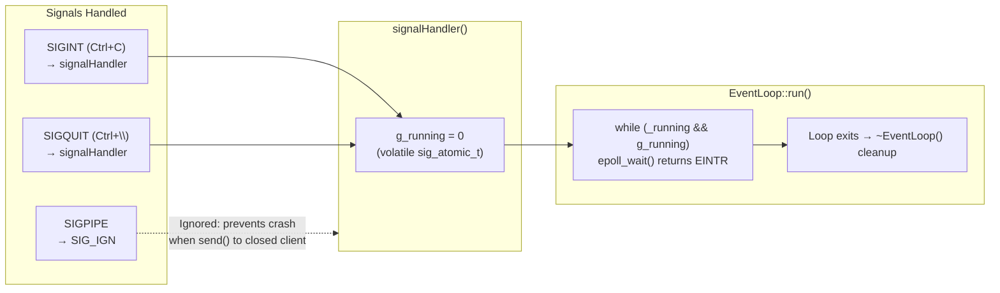

**Why `SIGPIPE` is ignored** ([main.cpp:L20](file:///home/aysadeq/Desktop/Webserv/srcs/main.cpp#L20)): If a client disconnects while you're `send()`ing data, the kernel sends `SIGPIPE` to your process. The default action is to **terminate the process**. By ignoring it, `send()` simply returns `-1` with `errno == EPIPE`, which `_handleWrite()` catches and handles gracefully via `_handleDisconnect()`.

---

## 11. Evaluator Q&A Scripts

### Q1: *"Why `epoll` instead of `select` or `poll`?"*
> *"`epoll` is $O(1)$ per event, while `poll` and `select` are $O(N)$. With `epoll`, we register FDs once into a kernel-side Red-Black Tree using `epoll_ctl` at [EventLoop.cpp:L433](file:///home/aysadeq/Desktop/Webserv/srcs/server/EventLoop.cpp#L433). When data arrives, a hardware interrupt callback pushes only that FD to a Ready List. `epoll_wait` at [L73](file:///home/aysadeq/Desktop/Webserv/srcs/server/EventLoop.cpp#L73) returns only active FDs — no scanning. With `poll`, we'd have to rebuild the entire `pollfd` array and the kernel would scan every single FD every iteration."*

### Q2: *"Show me where every socket is set to non-blocking."*
> *"Two places: (1) Listening sockets at [Socket.cpp:L114](file:///home/aysadeq/Desktop/Webserv/srcs/server/Socket.cpp#L114) inside `_setNonBlocking()`. (2) Accepted client sockets immediately after `accept()` at [EventLoop.cpp:L150](file:///home/aysadeq/Desktop/Webserv/srcs/server/EventLoop.cpp#L150). If we forgot either one, a slow client would block our entire single-threaded server."*

### Q3: *"What is `EAGAIN` / `EWOULDBLOCK` and how do you handle it?"*
> *"On non-blocking FDs, when there's no data to read or the send buffer is full, the syscall returns `-1` with `errno == EAGAIN`. It means 'I would have blocked — try later.' In `_handleAccept` at [L142](file:///home/aysadeq/Desktop/Webserv/srcs/server/EventLoop.cpp#L142), we break the accept-drain loop on `EAGAIN`. We then return to `epoll_wait` and let the kernel notify us when more data/space is available."*

### Q4: *"Why do you loop inside `_handleAccept()` instead of accepting just once?"*
> *"Multiple clients can complete the TCP handshake between two `epoll_wait()` calls. If we only `accept()` once per `EPOLLIN` on the listener, connections pile up in the kernel's backlog. We drain the queue by looping until `EAGAIN` — see the `while(true)` loop at [L135-L167](file:///home/aysadeq/Desktop/Webserv/srcs/server/EventLoop.cpp#L135-L167)."*

### Q5: *"How do you handle partial reads and partial writes?"*
> *"We never assume one `recv()` gives us a complete HTTP request, or one `send()` transmits the whole response. For reading, we `recv()` up to 8192 bytes at [L183](file:///home/aysadeq/Desktop/Webserv/srcs/server/EventLoop.cpp#L183) and feed them to Person B's streaming `request.feed()` at [L202](file:///home/aysadeq/Desktop/Webserv/srcs/server/EventLoop.cpp#L202). For writing, we track `writeOffset` — each `send()` at [L301](file:///home/aysadeq/Desktop/Webserv/srcs/server/EventLoop.cpp#L301) advances the offset, and the `Response` object can supply multiple chunks via `getNextChunk()` at [L318](file:///home/aysadeq/Desktop/Webserv/srcs/server/EventLoop.cpp#L318) for large files."*

### Q6: *"Show me where you prevent file descriptor leaks."*
> *"Every FD has exactly one close path: `_handleDisconnect()` at [L344-L357](file:///home/aysadeq/Desktop/Webserv/srcs/server/EventLoop.cpp#L344-L357) removes from `epoll`, closes CGI pipes if running, `close(clientFd)`, and erases from `_clients`. The destructor at [L33-L42](file:///home/aysadeq/Desktop/Webserv/srcs/server/EventLoop.cpp#L33-L42) catches any remaining FDs on shutdown. `Socket::~Socket()` at [Socket.cpp:L18-L24](file:///home/aysadeq/Desktop/Webserv/srcs/server/Socket.cpp#L18-L24) closes listening FDs. You can verify with `ls /proc/<pid>/fd` during stress testing."*

### Q7: *"What happens if a client connects but never sends anything?"*
> *"`_checkTimeouts()` at [L462-L495](file:///home/aysadeq/Desktop/Webserv/srcs/server/EventLoop.cpp#L462-L495) runs after every `epoll_wait()`. It compares `time(NULL) - client.lastActivity` against `CLIENT_TIMEOUT_SEC` (60 seconds). Idle clients get `_handleDisconnect()`'d. This prevents slowloris-style resource exhaustion."*

### Q8: *"How does CGI work without blocking the server?"*
> *"CGI pipe FDs (`stdinFd`, `stdoutFd`, `stderrFd`) are registered into the same `epoll` instance as client sockets — see [L269-L280](file:///home/aysadeq/Desktop/Webserv/srcs/server/EventLoop.cpp#L269-L280). When `epoll_wait` returns a pipe event, `_handleCgiReady()` at [L364](file:///home/aysadeq/Desktop/Webserv/srcs/server/EventLoop.cpp#L364) delegates to `onStdinReady()`, `onStdoutReady()`, or `onStderrReady()`. We also pause the client socket (`_removeEpollFd(clientFd)` at [L263](file:///home/aysadeq/Desktop/Webserv/srcs/server/EventLoop.cpp#L263)) during CGI, and re-register it for `EPOLLOUT` only when CGI finishes at [L420](file:///home/aysadeq/Desktop/Webserv/srcs/server/EventLoop.cpp#L420)."*

### Q9: *"What if a CGI script runs forever?"*
> *"`_checkTimeouts()` checks `client.cgi.checkTimeout()` at [L468](file:///home/aysadeq/Desktop/Webserv/srcs/server/EventLoop.cpp#L468). After `CGI_TIMEOUT_SEC` (60s), the handler kills the child process with `SIGTERM`, reaps it with `waitpid(WNOHANG)`, closes all pipe FDs, and sends a `504 Gateway Timeout` error page to the client at [L477](file:///home/aysadeq/Desktop/Webserv/srcs/server/EventLoop.cpp#L477)."*

### Q10: *"Why is `SIGPIPE` ignored?"*
> *"If a client disconnects while `send()` is writing to their socket, the kernel delivers `SIGPIPE` whose default action terminates the process. We `signal(SIGPIPE, SIG_IGN)` at [main.cpp:L20](file:///home/aysadeq/Desktop/Webserv/srcs/main.cpp#L20) so `send()` returns `-1` with `errno == EPIPE` instead, which `_handleWrite()` handles gracefully."*

### Q11: *"What is `SO_REUSEADDR` and why do you need it?"*
> *"When a TCP connection closes, the socket enters `TIME_WAIT` state for up to 2 minutes to handle delayed packets. Without `SO_REUSEADDR` at [Socket.cpp:L77](file:///home/aysadeq/Desktop/Webserv/srcs/server/Socket.cpp#L77), restarting our server immediately after stopping would fail with 'Address already in use'. This option lets us rebind to the same port instantly."*

### Q12: *"What does `listen(fd, 128)` mean? What's the 128?"*
> *"The second argument to `listen()` at [Socket.cpp:L103](file:///home/aysadeq/Desktop/Webserv/srcs/server/Socket.cpp#L103) is the backlog size — the maximum number of pending TCP connections that have completed the 3-way handshake but haven't been `accept()`'d yet. If the queue fills up, new `SYN` packets from clients are dropped. 128 is a common production value."*

---

## 12. Cheat Sheet

A single-page reference to keep open during defense:

| Constant | Value | Purpose | Defined At |
|----------|-------|---------|-----------|
| `POLL_TIMEOUT_MS` | 1000 | `epoll_wait` wakes every 1s even without events (for timeout checks) | [EventLoop.cpp:L17](file:///home/aysadeq/Desktop/Webserv/srcs/server/EventLoop.cpp#L17) |
| `CLIENT_TIMEOUT_SEC` | 60 | Close clients idle for 60 seconds | [EventLoop.cpp:L18](file:///home/aysadeq/Desktop/Webserv/srcs/server/EventLoop.cpp#L18) |
| `READ_BUFFER_SIZE` | 8192 | Stack buffer for `recv()` — one read per event cycle | [EventLoop.cpp:L19](file:///home/aysadeq/Desktop/Webserv/srcs/server/EventLoop.cpp#L19) |
| `CGI_TIMEOUT_SEC` | 60 | Kill CGI processes running longer than 60 seconds | [EventLoop.cpp:L20](file:///home/aysadeq/Desktop/Webserv/srcs/server/EventLoop.cpp#L20) |
| `MAX_EVENTS` | 1024 | Max events returned per `epoll_wait()` call | [EventLoop.cpp:L69](file:///home/aysadeq/Desktop/Webserv/srcs/server/EventLoop.cpp#L69) |
| Listen backlog | 128 | Max pending TCP handshakes in kernel queue | [Socket.cpp:L103](file:///home/aysadeq/Desktop/Webserv/srcs/server/Socket.cpp#L103) |

| Map | Key → Value | Purpose |
|-----|------------|---------|
| `_clients` | `clientFd → Client` | Tracks all active connections and their state |
| `_listenPorts` | `listenFd → port` | Identifies which FDs are listeners (for `_handleAccept`) |
| `_cgiToClient` | `pipeFd → clientFd` | Maps CGI pipe FDs back to their owning client |

| Event Flag | Meaning | Handler |
|-----------|---------|---------|
| `EPOLLIN` on listener | New connection pending | `_handleAccept()` |
| `EPOLLIN` on client | Data ready to read | `_handleRead()` |
| `EPOLLOUT` on client | Socket ready for writing | `_handleWrite()` |
| `EPOLLERR \| EPOLLHUP` | Connection error or hangup | `_handleDisconnect()` |
| `EPOLLIN` on CGI pipe | CGI stdout/stderr has data | `_handleCgiReady()` |
| `EPOLLOUT` on CGI pipe | CGI stdin ready for write | `_handleCgiReady()` |
