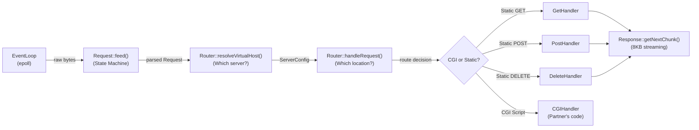
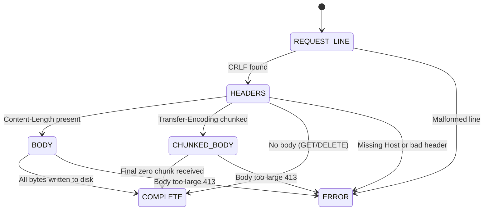
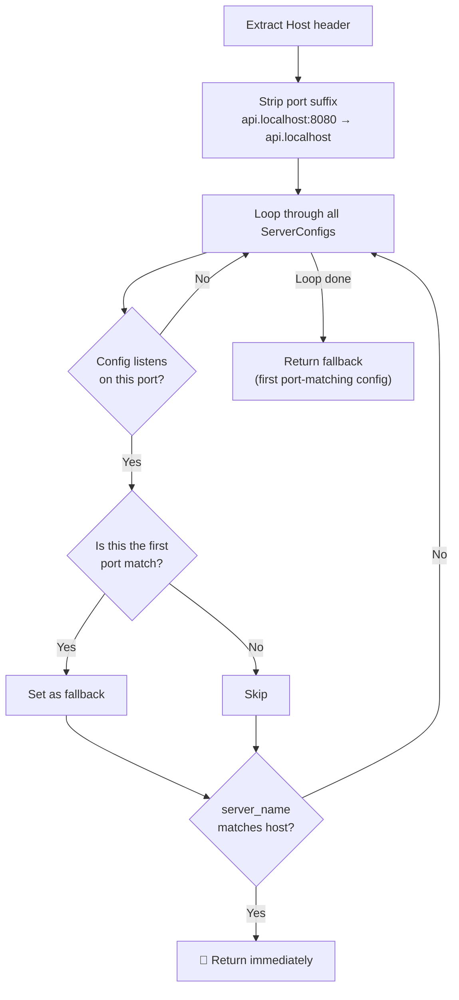
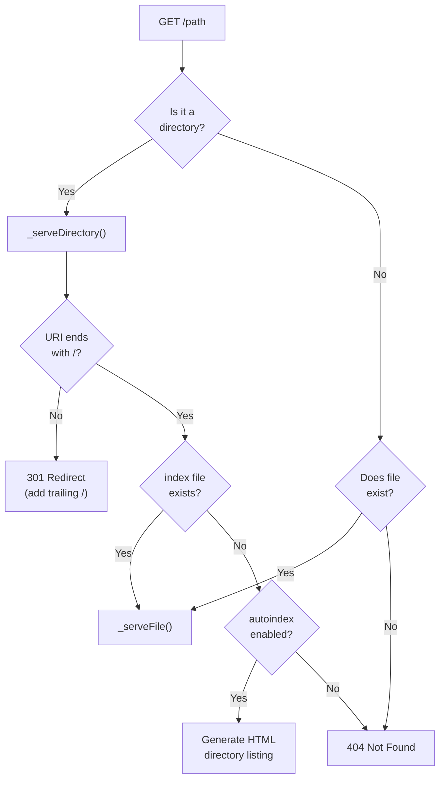
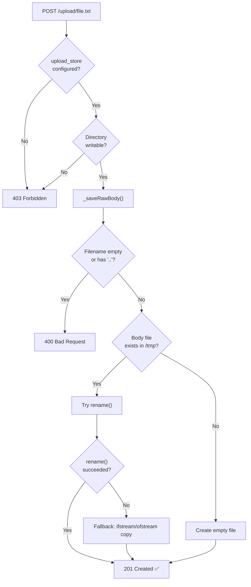

# 🛡️ Webserv Defense — Azedine's Part (HTTP Module)

> **Author:** Azedine
> **Scope:** HTTP Request Parsing, Routing, Handlers (GET/POST/DELETE), Response Building & File Streaming
> **Lines of Code Owned:** ~1,360 lines across 6 core files

---

## Table of Contents

1. [Architecture Overview](#1-architecture-overview)
2. [HTTP Request Parser](#2-http-request-parser)
3. [Router & Virtual Host Resolution](#3-router--virtual-host-resolution)
4. [GET Handler](#4-get-handler)
5. [POST Handler](#5-post-handler)
6. [DELETE Handler](#6-delete-handler)
7. [Response & File Streaming](#7-response--file-streaming)
8. [Security Measures](#8-security-measures)
9. [Edge Cases & Error Handling Summary](#9-edge-cases--error-handling-summary)
10. [Defense Quick-Fire Q&A](#10-defense-quick-fire-qa)
11. [Design Justifications Summary](#11-design-justifications-summary)

---

## 1. Architecture Overview

The HTTP module is the brain of Webserv. Every HTTP request flows through these components in order:



### Key Files

| File | Purpose |
|------|---------|
| [request.cpp](file:///home/azedine/Desktop/Webserv/srcs/http/request/request.cpp) | HTTP parser state machine (534 lines) |
| [router.cpp](file:///home/azedine/Desktop/Webserv/srcs/http/router/router.cpp) | Routing, virtual hosts, path resolution (248 lines) |
| [GetHandler.cpp](file:///home/azedine/Desktop/Webserv/srcs/http/router/GetHandler.cpp) | Static file & directory serving (131 lines) |
| [PostHandler.cpp](file:///home/azedine/Desktop/Webserv/srcs/http/router/PostHandler.cpp) | File upload handling (75 lines) |
| [HttpUtils.cpp](file:///home/azedine/Desktop/Webserv/srcs/http/router/HttpUtils.cpp) | Shared utilities (path traversal, error pages) |
| [response.cpp](file:///home/azedine/Desktop/Webserv/srcs/http/response/response.cpp) | Response building & 8KB file streaming (372 lines) |

### How My Code Connects to the Rest

> [!NOTE]
> **Understanding the full flow is key for defense.** The EventLoop (partner's code) calls `Request::feed()` whenever `epoll_wait()` returns an `EPOLLIN` event on a client socket. Once the Request state machine reaches `COMPLETE`, the EventLoop passes the `Request` object to `Router::handleRequest()`. The Router produces a `Response`, and the EventLoop calls `Response::getNextChunk()` in a loop whenever the socket is writable (`EPOLLOUT`), sending data 8KB at a time without blocking.

---

## 2. HTTP Request Parser

### 2.1 The State Machine

The parser is a **non-blocking state machine**. It never waits for a complete request. Instead, the `EventLoop` feeds it raw bytes via `feed()`, and the parser advances through states as data becomes available.



> [!IMPORTANT]
> **Why a state machine and not just "read the whole thing"?**
> In a non-blocking server, you never know how many bytes you'll receive in a single `read()` call. A state machine lets us process partial data gracefully — if we get half a header line, we simply stay in the `HEADERS` state and wait for the next `feed()` call to bring the rest. This is what makes the server truly non-blocking.

### 2.2 The `feed()` Loop — Why `do-while`?

```cpp
void Request::feed(const std::string &data) {
    _buffer.append(data);

    ParseState prevState;
    size_t prevBufSize;
    do {
        prevState = _state;
        prevBufSize = _buffer.size();

        if (_state == REQUEST_LINE)  _parseRequestLine();
        if (_state == HEADERS)       _parseHeaders();
        if (_state == BODY)          _parseBody();
        if (_state == CHUNKED_BODY)  _parseChunkedBody();

    } while ((_state != prevState || _buffer.size() != prevBufSize)
             && _state != COMPLETE && _state != ERROR);
}
```

> [!IMPORTANT]
> **Why track both `prevState` AND `prevBufSize`?**
> Some operations like `_skipLeadingCRLF()` consume buffer bytes **without** changing the state. If we only tracked `prevState`, the loop would exit too early, leaving unprocessed data in the buffer. Tracking `prevBufSize` catches this case.

**Why `do-while` and not just `while`?**
We need to execute the parsing functions **at least once** for every `feed()` call. A `while` loop with the "did something change?" condition would require initializing `prevState` and `prevBufSize` to impossible values. The `do-while` is cleaner — try first, then check if progress was made.

### 2.3 Request Line Parsing

**Function:** [_parseRequestLine()](file:///home/azedine/Desktop/Webserv/srcs/http/request/request.cpp#L358-L391)

**What it does:**
1. Skips leading `\r\n` (RFC 2616 §4.1 — some clients send extra blank lines between requests)
2. Checks if the request line exceeds **8192 bytes** → returns `414 URI Too Long`
3. Splits `"GET /index.html HTTP/1.1"` into `_method`, `_uri`, `_version`
4. Validates the method is one of: `GET`, `POST`, `DELETE` → otherwise `405`
5. Validates the version is `HTTP/1.0` or `HTTP/1.1` → otherwise `400`
6. Splits the URI at `?` into `_path` and `_queryString`
7. Validates the path starts with `/` → otherwise `400`

> [!NOTE]
> **Why skip leading CRLF?** RFC 2616 §4.1 says: "In the interest of robustness, servers SHOULD ignore any empty line(s) received where a Request-Line is expected." Some buggy HTTP clients (or keep-alive connections) send extra `\r\n` between requests.

### 2.4 Header Parsing

**Function:** [_parseHeaders()](file:///home/azedine/Desktop/Webserv/srcs/http/request/request.cpp#L394-L429)

**Edge cases handled:**

| Edge Case | How We Handle It | Error Code |
|-----------|-----------------|------------|
| Header block > 16KB | Reject immediately | `431` |
| Missing colon in header line | Reject | `400` |
| Space before colon (`X -Header : val`) | Reject (RFC violation) | `400` |
| Empty header key | Reject | `400` |
| Missing `Host` header in HTTP/1.1 | Reject | `400` |
| Invalid `Content-Length` (not a number) | Reject | `400` |
| `Content-Length` exceeds `client_max_body_size` | Early rejection | `413` |

**Why is `Host` required in HTTP/1.1 but not HTTP/1.0?**
HTTP/1.1 introduced **Virtual Hosting** — the ability to host multiple websites on a single IP address. Without `Host`, the server doesn't know which `server_name` the client wants, so `resolveVirtualHost()` would completely break. HTTP/1.0 was designed before virtual hosting existed, so it never required `Host`.

### 2.5 Body Parsing — Streaming to Disk

**Function:** [_parseBody()](file:///home/azedine/Desktop/Webserv/srcs/http/request/request.cpp#L432-L470)

> [!IMPORTANT]
> **Critical Design Decision: Body-to-Disk Streaming**
> The body is **never** stored in RAM. Each chunk of data is immediately written to a temporary file in `/tmp/` using `std::ios::app` (append mode). This prevents Out-Of-Memory (OOM) crashes when users upload large files (e.g., 500MB videos).

**How it works:**
1. On the first write, generates a unique temp file path using `getpid()` + a static counter
2. Opens the file in `binary | append` mode
3. Writes using pointer arithmetic: `out.write(_buffer.c_str(), toWrite)` — no intermediate `std::string` copy
4. Checks `out.fail() || out.bad()` for disk-full errors → returns `500`
5. Erases the written bytes from `_buffer`
6. When `_bodyBytesWritten >= _contentLength` → state becomes `COMPLETE`

**Why `getpid()` + static counter for filename uniqueness?**
In a multi-process environment, `getpid()` ensures no two processes create the same file. The static counter ensures that within a single process, concurrent requests (on different connections) each get a unique temp file. Together they guarantee uniqueness without needing `mkstemp()` or random number generators.

### 2.6 Chunked Body Parsing

**Function:** [_parseChunkedBody()](file:///home/azedine/Desktop/Webserv/srcs/http/request/request.cpp#L473-L534)

Chunked transfer encoding sends data in pieces, each prefixed by a hex size:

```
5\r\n
Hello\r\n
6\r\n
World!\r\n
0\r\n
\r\n
```

**Key implementation details:**

1. **Hex parsing:** Uses `_parseNumber(sizeStr, chunkSize, 16)` with base-16 for hexadecimal
2. **Chunk extensions:** Strips anything after `;` (e.g., `5;ext=val` → `5`)
3. **Termination:** When `chunkSize == 0`, waits for the full `0\r\n\r\n` sequence before marking `COMPLETE`
4. **Pointer arithmetic:** `out.write(_buffer.c_str() + pos + 2, csz)` — writes chunk data directly from the buffer to disk without creating a temporary `std::string`, saving memory
5. **Body size enforcement:** Checks `_bodyBytesWritten + csz > _maxBodySize` before each chunk write → returns `413`

> [!NOTE]
> **Why is chunked encoding useful?**
> Chunked encoding is used when the sender doesn't know the total body size upfront. For example, a CGI script generating dynamic output streams it in chunks. Without chunked encoding, the server would need to buffer the entire response in memory just to calculate `Content-Length`.

### 2.7 `Transfer-Encoding: chunked` vs `Content-Length`

> [!NOTE]
> **RFC 2616 §4.4:** If both `Transfer-Encoding: chunked` and `Content-Length` are present, `Transfer-Encoding` takes priority. `Content-Length` is completely ignored because the chunk boundaries dictate the body structure.

```cpp
// In _validateHeaders():
if (_isChunked)
    _contentLength = 0; // Chunked overrides Content-Length
```

**Why does chunked win?** Because `Content-Length` could be wrong — the actual data boundaries are defined by the chunk sizes. If we trusted `Content-Length` and ignored chunk markers, we'd either read too much (corrupting the next request) or too little (truncating the body).

### 2.8 Keep-Alive & Connection Management

```cpp
// Default behavior:
// HTTP/1.1 → keep-alive (reuse connection)
// HTTP/1.0 → close (one request per connection)
_keepAlive = (_version == "HTTP/1.1");
```

The `reset()` function clears all parsed data but **preserves `_buffer`** — because leftover bytes in the buffer might belong to the next pipelined request on the same TCP connection.

> [!IMPORTANT]
> **Why preserve the buffer on reset?**
> HTTP pipelining means a client can send Request #2 before receiving the response to Request #1. The `read()` call might return bytes for both requests at once. After completing Request #1, the leftover bytes in `_buffer` are the beginning of Request #2. If we cleared the buffer, we'd lose that data and the second request would hang forever.

---

## 3. Router & Virtual Host Resolution

### 3.1 Virtual Host Resolution (NGINX Algorithm)

**Function:** [resolveVirtualHost()](file:///home/azedine/Desktop/Webserv/srcs/http/router/router.cpp#L212-L247)

This implements the exact same algorithm as NGINX for choosing which `server {}` block to use:



**The Port Filter (Security Guard):**
The `listenPort` parameter acts as a security filter. If a `ServerConfig` doesn't listen on the client's connection port, it is completely skipped. This prevents cross-contamination between server blocks.

**The Fallback:**
If no `server_name` matches, the first `ServerConfig` that matches the port is returned. This is identical to NGINX's `default_server` behavior.

**Why return a Pointer (`const ServerConfig *`) instead of a Reference?**
Because the Router is an independent component that doesn't know about the EventLoop's socket architecture. It must handle the theoretical case of finding no match, and you cannot return a "null reference" in C++. Returning a pointer allows the clean `return NULL` fallback.

> [!NOTE]
> **Why strip the port from the Host header?**
> Clients send `Host: example.com:8080`, but `server_name` in config is just `example.com`. If we compared the raw `Host` header against `server_name`, it would never match when a non-standard port is used. Stripping the port normalizes the comparison.

### 3.2 Location Matching — Longest Prefix Wins

**Function:** [matchLocation()](file:///home/azedine/Desktop/Webserv/srcs/http/router/router.cpp#L91-L113)

Given URI `/images/cat.jpg` and locations `location /` and `location /images`:

| Iteration | Prefix | Matches URI? | prefix.size() > bestLen? | Result |
|-----------|--------|-------------|------------------------|--------|
| 1 | `/` | ✅ (`/` starts `/images/cat.jpg`) | 1 > 0 ✅ | best = `/`, bestLen = 1 |
| 2 | `/images` | ✅ (`/images` starts `/images/cat.jpg`) | 7 > 1 ✅ | best = `/images`, bestLen = 7 |

**Winner: `/images`** (longest prefix)

**Boundary Guard (Line 102):**
```cpp
if (prefix != "/" && prefix.size() < uri.size() && uri[prefix.size()] != '/')
    continue;
```
This prevents `/images` from matching `/img` or `/imagination`. The character immediately after the prefix must be `/` (a path boundary) to ensure a legitimate match.

> [!IMPORTANT]
> **Why "longest prefix" and not "first match"?**
> Longest prefix gives the most specific configuration. If you have `location /` with `autoindex off` and `location /gallery` with `autoindex on`, you want `/gallery/photos` to use the `/gallery` config, not the generic `/`. First-match would depend on config file ordering, which is fragile and error-prone. Longest-prefix always picks the most relevant location regardless of declaration order.

### 3.3 The Router Pipeline

**Function:** [handleRequest()](file:///home/azedine/Desktop/Webserv/srcs/http/router/router.cpp#L22-L85)

The Router processes every request through a strict pipeline of checks:

```
Step 1: matchLocation()        → Find the best LocationConfig (longest prefix)
Step 2: Check req.hasError()   → If parser failed, return error immediately
Step 3: Check loc == NULL      → No location matched → 404
Step 4: Check redirect         → If location has `return 301 url` → redirect
Step 5: _isMethodAllowed()     → If method not in allowed_methods → 405
Step 6: Check body size        → If body > client_max_body_size → 413
Step 7: _resolvePath()         → Convert URI to filesystem path
Step 8: hasPathTraversal()     → If path contains ".." → 403
Step 9: Check CGI extension    → If file extension matches cgi_map → delegate to CGI
Step 10: Route to Handler      → GET/POST/DELETE
```

> [!NOTE]
> **Why is the order important?**
> The pipeline follows a "fail fast" principle. Cheaper checks (error flags, NULL pointer) come first. Expensive checks (filesystem operations in handlers) come last. This also ensures security: path traversal is checked **before** any filesystem access.

### 3.4 Path Resolution (`root` vs `alias`)

**Function:** [_resolvePath()](file:///home/azedine/Desktop/Webserv/srcs/http/router/router.cpp#L135-L180)

| Directive | Config Example | URI | Filesystem Path |
|-----------|---------------|-----|----------------|
| `root` | `root www;` with `location /images` | `/images/cat.jpg` | `www/cat.jpg` (strips prefix) |
| `alias` | `alias www/uploads;` with `location /uploads` | `/uploads/file.txt` | `www/uploads/file.txt` (replaces prefix) |

**Why `root` strips the location prefix:**
Because `root` means "the root directory for this location." The location path is just a routing prefix, not part of the filesystem path.

**Why `alias` replaces the location prefix:**
Because `alias` means "this exact directory." The location path is swapped out entirely for the alias path.

**Slash joining safety:**
The code handles 4 possible slash combinations between `root/alias` and `remainder`:
- Both have `/` → remove one
- Neither has `/` → add one
- Only one has `/` → no change needed

> [!IMPORTANT]
> **Common evaluator question: "What's the difference between root and alias?"**
> Think of it this way:
> - `root` says "look for the file starting from this directory, using the **full URI path**"
> - `alias` says "replace the location prefix with this directory path"
>
> Example with `location /static` and URI `/static/css/style.css`:
> - `root /var/www` → `/var/www/static/css/style.css` (keeps `/static`)
> - `alias /var/www` → `/var/www/css/style.css` (removes `/static`, replaces with alias)

### 3.5 Dual-Layer Body Size Check

> [!NOTE]
> **Why check `client_max_body_size` in BOTH the Parser AND the Router?**
> - **Parser check:** Uses the global server-level `client_max_body_size` for early rejection (before routing)
> - **Router check:** Uses the location-specific `client_max_body_size` which can be different per location. For example, `/upload` might allow 10MB while `/` only allows 1MB.

---

## 4. GET Handler

**File:** [GetHandler.cpp](file:///home/azedine/Desktop/Webserv/srcs/http/router/GetHandler.cpp)

### 4.1 Decision Tree



### 4.2 File Serving with Safety Checks

```cpp
void GetHandler::_serveFile(const std::string &filePath, Response &res) {
    struct stat st;
    // 1. Verify it's a regular file (not a socket, pipe, etc.)
    if (stat(filePath.c_str(), &st) != 0 || !S_ISREG(st.st_mode))
        → 404

    // 2. Verify read permissions
    if (access(filePath.c_str(), R_OK) != 0)
        → 403

    // 3. Serve with correct MIME type and file size
    res.setStatus(200);
    res.setHeader("Content-Type", getMimeType(extension));
    res.setFilePath(filePath, st.st_size);
}
```

**Why `stat()` before `access()`?**
- `stat()` checks if the file exists AND if it's a regular file (not a directory, socket, or named pipe)
- `access()` checks if the process has read permissions
- Both are needed: a file can exist but be unreadable, or a path can point to a non-file

**Why check `S_ISREG()`?**
Without this check, someone could request a path that maps to a Unix socket or a named pipe. Trying to `read()` from those would either hang indefinitely or return garbage. `S_ISREG()` ensures we only serve actual files.

### 4.3 Directory Trailing Slash Redirect

```cpp
if (uri.empty() || uri[uri.size() - 1] != '/') {
    res.buildRedirect(301, uri + "/");
    return;
}
```

**Why?** If a user requests `/images` (no trailing slash), the browser would resolve relative links incorrectly. `/images/cat.jpg` would become `/cat.jpg` instead of `/images/cat.jpg`. The `301` redirect to `/images/` fixes this permanently.

> [!NOTE]
> **Why `301` (permanent) and not `302` (temporary)?**
> A `301` tells the browser to **cache** this redirect. Next time the user types `/images`, the browser goes directly to `/images/` without hitting the server again. `302` would cause a roundtrip every time. Since a directory will always need a trailing slash, the redirect is permanent.

### 4.4 Autoindex (Directory Listing)

Uses `opendir()` + `readdir()` to read directory contents, sorts them alphabetically using a simple bubble sort, then generates an HTML page with clickable links. Directories get a trailing `/` in the display name.

**Why bubble sort?** Directory listings typically have a small number of entries (dozens, not thousands). Bubble sort is O(n²) but trivially simple to implement in C++98 with no external dependencies. For small n, the performance difference versus `std::sort` with a comparator is negligible.

---

## 5. POST Handler

**File:** [PostHandler.cpp](file:///home/azedine/Desktop/Webserv/srcs/http/router/PostHandler.cpp)

### 5.1 Safety Pipeline



### 5.2 The `std::rename()` Fallback

```cpp
if (std::rename(req.getBodyFilePath().c_str(), savePath.c_str()) != 0) {
    // Fallback: manual copy
    std::ifstream src(req.getBodyFilePath().c_str(), std::ios::binary);
    std::ofstream dst(savePath.c_str(), std::ios::binary);
    dst << src.rdbuf();
}
```

**Why `rename()` can fail:**
`std::rename()` uses the Linux system call `rename(2)`, which moves a file by updating the filesystem's directory entry (no data is copied — it's instant). However, it fails with `EXDEV` (cross-device link) when the source and destination are on **different filesystems**. This happens when `/tmp` is mounted on `tmpfs` (RAM disk) and `www/uploads/` is on the physical hard drive. The fallback copies the file byte-by-byte using `rdbuf()` streaming.

> [!NOTE]
> **Why try `rename()` first instead of always copying?**
> `rename()` on the same filesystem is O(1) — it just updates a directory entry, no data movement at all. For a 500MB upload, that's instant vs. several seconds of copying. We only fall back to copying when `rename()` fails, getting the best of both worlds.

### 5.3 Filename Extraction (Flat Hierarchy)

```cpp
std::string filename = req.getPath();
size_t slash = filename.rfind('/');
if (slash != std::string::npos)
    filename = filename.substr(slash + 1);
```

The filename is extracted from the **last segment** of the URI path. This enforces a flat directory structure — you cannot upload to subdirectories (e.g., `/upload/subdir/file.txt` saves as `file.txt`, not `subdir/file.txt`). This is a deliberate security measure to prevent directory creation attacks.

### 5.4 Status Code: `201 Created`

**Why `201` instead of `200`?**
- `200 OK` = "I processed your request successfully" (reading/deleting existing data)
- `201 Created` = "I processed your request AND a **new resource** was permanently created on the server"

The HTTP spec requires `201` for any operation that creates a new resource.

---

## 6. DELETE Handler

**Function:** [_handleDelete()](file:///home/azedine/Desktop/Webserv/srcs/http/router/router.cpp#L186-L206)

### 6.1 Safety Checks

```cpp
// 1. Cannot delete directories (prevent recursive deletion disasters)
if (HttpUtils::isDirectory(filePath)) → 403

// 2. File must exist
if (!HttpUtils::fileExists(filePath)) → 404

// 3. Attempt deletion using unlink() system call
if (unlink(filePath.c_str()) != 0) → 500

// 4. Success
→ 200 "File deleted successfully"
```

**Why `unlink()` instead of `std::remove()`?**
Both work, but `unlink()` is the POSIX standard for file deletion. It removes the directory entry and decrements the file's link count. The actual disk space is freed when no process has the file open.

**Why block directory deletion?**
Allowing `DELETE` on directories would require recursive deletion (`rmdir()` only works on empty directories). A single malicious `DELETE /` request could wipe the entire server. By restricting to files only, we prevent catastrophic data loss.

---

## 7. Response & File Streaming

**File:** [response.cpp](file:///home/azedine/Desktop/Webserv/srcs/http/response/response.cpp)

### 7.1 Three Response Modes

| Mode | When Used | Memory Usage |
|------|-----------|-------------|
| **String Mode** | Error pages, redirects, small responses | Body stored in `_body` string |
| **File Mode** | Static files (HTML, images, videos) | 8KB buffer, streamed from disk |
| **CGI Chunked Mode** | CGI script output | Chunks forwarded as they arrive |

### 7.2 The 8KB Streaming Loop

```cpp
std::string Response::getNextChunk() {
    // 1. First call: send HTTP headers only
    if (!_headersSent) {
        _headersSent = true;
        return getHeaders();   // "HTTP/1.1 200 OK\r\nContent-Type: ...\r\n\r\n"
    }

    // 2. File Mode: read 8KB at a time
    std::ifstream file(_filePath.c_str(), std::ios::binary);
    file.seekg(_fileOffset);        // Resume from last position

    char buffer[8192];
    file.read(buffer, sizeof(buffer));
    size_t bytesRead = file.gcount();    // ← CRITICAL: actual bytes read
    _fileOffset += bytesRead;

    if (_fileOffset >= _fileSize || bytesRead == 0)
        _done = true;

    return std::string(buffer, bytesRead);
}
```

> [!IMPORTANT]
> **Why send headers and body separately?**
> The headers must be sent as a single contiguous string (the HTTP protocol requires `\r\n\r\n` to terminate the header block). If we mixed header bytes with file bytes in the same chunk, the browser wouldn't know where headers end and body begins. Sending headers first, then streaming body chunks, keeps the protocol clean.

### 7.3 Why `gcount()` Instead of `sizeof(buffer)`?

> [!CAUTION]
> **If you used `sizeof(buffer)` (8192) instead of `gcount()`:**
> On the **last chunk** of a file, `file.read()` might only read 1,808 bytes (the remaining data). But `sizeof(buffer)` is always 8,192. You would send 6,384 bytes of **uninitialized garbage memory** to the browser, corrupting the file!

**Example:** Serving a 10,000-byte image:
- Chunk 1: `gcount()` = 8,192 → ✅ full buffer
- Chunk 2: `gcount()` = 1,808 → ✅ only the real data, zero garbage

### 7.4 Why `seekg()` Instead of Keeping the File Open?

The `Response` class does NOT store an `std::ifstream` member. Instead, it opens the file fresh on every `getNextChunk()` call and uses `seekg(_fileOffset)` to jump to where it left off.

**Why?** The Orthodox Canonical Form (OCF). `std::ifstream` is **non-copyable** in C++98. If `Response` contained an `ifstream` member, the copy constructor and assignment operator (required by OCF) would fail to compile. By storing only `_fileOffset` (a `size_t`), the `Response` object remains fully copyable.

> [!NOTE]
> **Isn't opening/closing the file on every chunk slow?**
> In practice, no. The OS kernel caches recently accessed files in the **page cache** (RAM). After the first `open()`, subsequent `open()` + `seekg()` + `read()` calls hit the kernel cache, not the physical disk. The overhead is a few microseconds — negligible compared to network I/O latency (milliseconds).

### 7.5 Why 8KB Specifically?

8KB (8192 bytes) is a common choice because:
- It matches the typical **page size** on Linux (4KB or 8KB), making kernel I/O efficient
- It's large enough to minimize the number of `write()` system calls
- It's small enough to avoid holding too much memory per connection
- NGINX uses a similar default (`proxy_buffer_size 8k`)

---

## 8. Security Measures

### 8.1 Path Traversal Protection

```cpp
bool HttpUtils::hasPathTraversal(const std::string &path) {
    return (path.find("..") != std::string::npos);
}
```

**Attack example:** `GET /uploads/../../../etc/passwd HTTP/1.1`
Without this check, the server would resolve this to `/etc/passwd` and serve the Linux password file to the hacker.

> [!IMPORTANT]
> **Why check for `..` anywhere in the string, not just `/../`?**
> An attacker could encode it as `..%2F`, `%2E%2E/`, or use double encoding. By checking for the raw `..` substring after URL decoding, we catch all variations. This is a conservative approach — it might reject some legitimate filenames containing `..`, but security takes priority.

### 8.2 Permission Checks

| Check | Function | Purpose |
|-------|----------|---------|
| `access(path, R_OK)` | GetHandler | Verify read permissions before serving |
| `access(path, W_OK)` | PostHandler | Verify write permissions before uploading |
| `S_ISREG(st.st_mode)` | GetHandler | Prevent serving sockets, pipes, devices |
| `S_ISDIR(st.st_mode)` | DeleteHandler | Prevent deleting entire directories |

### 8.3 Request Size Limits

| What | Limit | Error Code |
|------|-------|------------|
| Request line (URI) | 8,192 bytes | `414 URI Too Long` |
| Header block | 16,384 bytes | `431 Request Header Fields Too Large` |
| Body (per-location) | `client_max_body_size` | `413 Payload Too Large` |

> [!NOTE]
> **Why have these limits?**
> Without size limits, an attacker could send a 1GB URI or an infinitely long header block, exhausting server memory. These limits are the first line of defense against Denial-of-Service (DoS) attacks. The values (8KB for URI, 16KB for headers) match industry standards used by NGINX and Apache.

---

## 9. Edge Cases & Error Handling Summary

| Scenario | Where Handled | Response |
|----------|--------------|----------|
| Slow client (1 byte at a time) | `Request::feed()` state machine | Waits patiently, never blocks |
| `Content-Length` + `Transfer-Encoding: chunked` | `_validateHeaders()` | Chunked takes priority (RFC 2616 §4.4) |
| Missing `Host` in HTTP/1.1 | `_validateHeaders()` | `400 Bad Request` |
| Body exceeds limit mid-stream | `_parseBody()` / `_parseChunkedBody()` | `413 Payload Too Large` |
| Disk full during upload | `_parseBody()` checks `out.fail()` | `500 Internal Server Error` |
| `rename()` fails (cross-device) | `PostHandler::_saveRawBody()` | Falls back to `ifstream`/`ofstream` copy |
| URI contains `..` | `Router::handleRequest()` | `403 Forbidden` |
| Directory without trailing `/` | `GetHandler::_serveDirectory()` | `301 Redirect` with `/` appended |
| No `index.html` + autoindex off | `GetHandler::_serveDirectory()` | `404 Not Found` |
| POST to location without `upload_store` | `PostHandler::handle()` | `403 Forbidden` |
| Upload directory not writable | `PostHandler::handle()` | `403 Forbidden` |
| Unsupported HTTP method | `Router::_isMethodAllowed()` | `405 Method Not Allowed` |
| No matching location | `Router::handleRequest()` | `404 Not Found` |
| Virtual host mismatch | `resolveVirtualHost()` | Falls back to first port-matching config |

---

## 10. Defense Quick-Fire Q&A

These are common evaluator questions with concise answers. Use this as a last-minute cheat sheet.

### Parser Questions

**Q: "What happens if a client sends data 1 byte at a time?"**
A: The state machine handles it perfectly. Each `feed()` call appends to `_buffer`. If there isn't enough data to complete a parse step, the state doesn't change, and we return. Next `feed()` call picks up where we left off. No blocking, no timeout, no data loss.

**Q: "What happens if the client never finishes sending?"**
A: The EventLoop handles connection timeouts. My parser just waits in its current state. When the EventLoop detects inactivity, it closes the socket and destroys the Request object, cleaning up the temp file.

**Q: "Why write the body to disk instead of keeping it in memory?"**
A: Memory safety. If 100 clients simultaneously upload 50MB files, that's 5GB of RAM. Writing to disk keeps memory usage constant regardless of upload size. We use `/tmp` which is often `tmpfs` (RAM-backed), so small uploads are still fast.

**Q: "How do you handle pipelining?"**
A: The `reset()` method clears parsed data but preserves `_buffer`. If a `read()` call returns data for two requests concatenated together, the parser completes the first request, then `reset()` is called, and `feed("")` (or the next `feed()`) processes the remaining buffer for the second request.

### Router Questions

**Q: "How does your server handle multiple server blocks on the same port?"**
A: Virtual host resolution. We look at the `Host` header and match it against `server_name` directives. If no match, we fall back to the first server block listening on that port — same as NGINX's `default_server`.

**Q: "What's the difference between `root` and `alias`?"**
A: `root` appends the full URI to the root path (but strips the location prefix). `alias` replaces the location prefix with the alias path. Think: `root` = "here's where files live, use the URI to find them." `alias` = "this exact path IS the files."

**Q: "Why check path traversal AFTER resolving the path?"**
A: We check it on the resolved filesystem path, not the raw URI. This ensures that even if the path resolution logic adds or removes segments, the final path used for filesystem access is still safe.

### Handler Questions

**Q: "Why does GET redirect directories without trailing slashes?"**
A: Browser relative URL resolution. Without a trailing slash, the browser treats the directory name as a file, and relative links break. `301` makes it permanent so the browser caches it.

**Q: "Why does POST return 201 instead of 200?"**
A: HTTP semantics. `200` means "OK, processed." `201` means "OK, and a new resource was created." The spec says `201` is the correct status when a POST creates a resource.

**Q: "What if `rename()` fails?"**
A: We catch it and fall back to `ifstream`/`ofstream` copy. `rename()` fails with `EXDEV` when source and destination are on different filesystems (e.g., `/tmp` on `tmpfs`, uploads on ext4). The fallback is slower but always works.

### Response Questions

**Q: "Why reopen the file on every chunk?"**
A: OCF compliance. `std::ifstream` is non-copyable in C++98. If `Response` had an `ifstream` member, copy constructor and assignment operator would break. We store `_fileOffset` instead and use `seekg()`. The OS page cache makes repeated opens nearly free.

**Q: "What's `gcount()` and why is it important?"**
A: `gcount()` returns how many bytes `read()` actually read. On the last chunk, `read()` might return fewer bytes than the buffer size. Using `sizeof(buffer)` instead would send garbage memory to the client, corrupting the response.

---

## 11. Design Justifications Summary

This table summarizes every major "why" decision in the codebase — useful for rapid reference during defense:

| Decision | Why | What Breaks Without It |
|----------|-----|----------------------|
| Non-blocking state machine parser | Works with epoll, handles partial data | Server blocks on slow clients |
| Body written to disk, not RAM | Prevents OOM with large uploads | 100 × 50MB uploads = 5GB RAM crash |
| `do-while` with dual condition | Catches buffer-only changes (no state transition) | Unprocessed data left in buffer |
| `getpid()` + counter for temp files | Unique filenames without `mkstemp()` | Concurrent uploads overwrite each other |
| Chunked overrides Content-Length | RFC 2616 §4.4 compliance | Corrupted body parsing |
| Buffer preserved on `reset()` | Supports HTTP pipelining | Second request data lost |
| Longest prefix location matching | Most specific config wins | Wrong config applied to requests |
| Boundary guard in location matching | Prevents false partial matches | `/images` matches `/img` |
| Port filter in virtual host resolution | Security isolation between servers | Cross-contamination of server blocks |
| Pointer return for virtual host | Allows NULL for "no match" case | Cannot represent missing config with reference |
| `root` strips prefix, `alias` replaces | Different filesystem mapping semantics | Wrong file paths served |
| Dual body-size checks (parser + router) | Server-level vs location-level limits | Cannot have different limits per location |
| `stat()` + `S_ISREG()` before serving | Prevents serving non-files | Hang on sockets/pipes, garbage from devices |
| `access(R_OK)` check | Prevents permission errors during read | Cryptic 500 error instead of clean 403 |
| Trailing slash redirect (301) | Fixes browser relative URL resolution | All relative links in directory listings break |
| Flat filename extraction (`rfind('/')`) | Prevents directory creation attacks | Attacker creates arbitrary directory trees |
| `rename()` with copy fallback | Fast on same FS, works across FS | Fails silently on cross-device uploads |
| `201 Created` for POST | HTTP spec compliance | Technically incorrect, evaluator may notice |
| `unlink()` not `std::remove()` | POSIX standard, clear semantics | Both work, but unlink is more explicit |
| Block directory deletion | Prevents catastrophic recursive deletion | Single `DELETE /` wipes server |
| Headers sent separately from body | HTTP protocol requires header/body separation | Browser can't parse response |
| `gcount()` not `sizeof(buffer)` | Correct byte count on last chunk | Garbage bytes corrupt response |
| `seekg()` instead of persistent ifstream | OCF compliance (ifstream non-copyable in C++98) | Copy constructor fails to compile |
| 8KB chunk size | Matches page size, balances memory vs syscalls | Too small = too many writes, too large = wasted RAM |
| Path traversal check (`..`) | Prevents reading arbitrary system files | Attacker reads `/etc/passwd` |
| URI/header size limits | DoS prevention | Attacker exhausts server memory |

---

> [!TIP]
> **Defense Strategy:** When an evaluator asks "why did you do X?", always answer in this order:
> 1. **What** the code does
> 2. **Why** we chose this approach (security, memory efficiency, RFC compliance)
> 3. **What would break** if we didn't do it
