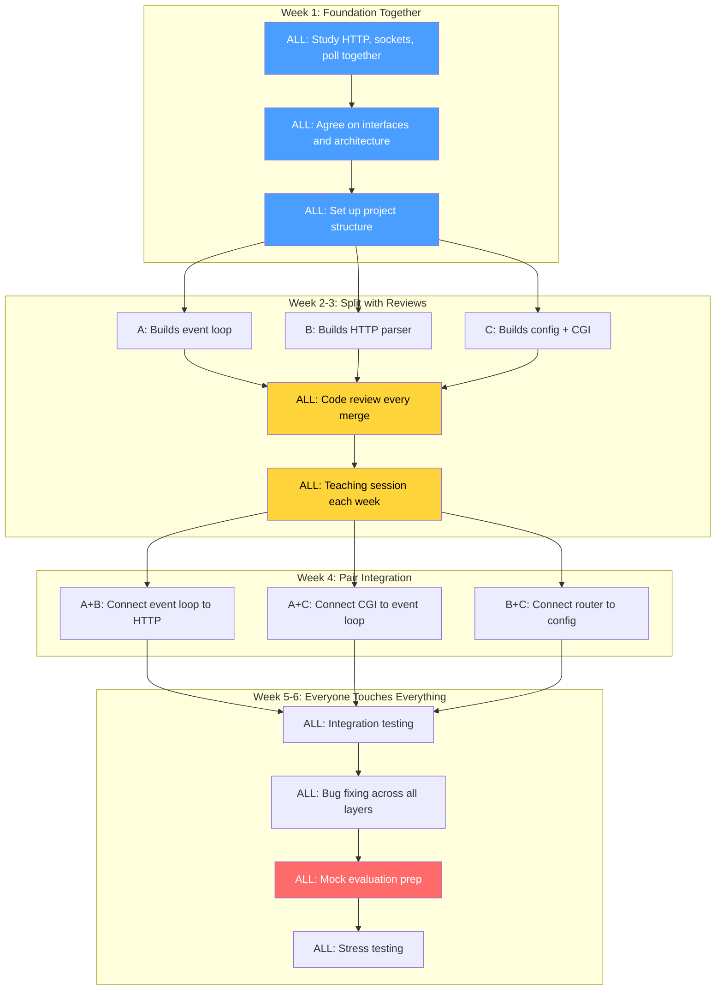

# Webserv — Task Split Analysis (3 People)

## TL;DR

The **layer-based split** (Networking / HTTP Protocol / Config+CGI) is the best approach. But splitting **does** reduce individual learning — here's exactly how, and what to do about it.

---

## 1. The Three Ways You Could Split This Project

### Option A: Layer-Based Split ✅ (Recommended)

| Person | Owns | Core Skills Learned |
|--------|------|-------------------|
| **A** | Sockets, event loop, connection management | `poll()`/`epoll()`, non-blocking I/O, FD management |
| **B** | HTTP parsing, routing, response building, static serving | RFC 2616, MIME types, chunked encoding, file I/O |
| **C** | Config parser, CGI execution | `fork()`/`execve()`/`pipe()`, string parsing, process management |

### Option B: Feature-Based Split

| Person | Owns | Core Skills Learned |
|--------|------|-------------------|
| **A** | GET requests end-to-end (socket → parse → serve → respond) | Broad but shallow across everything |
| **B** | POST/DELETE + file uploads end-to-end | Broad but shallow across everything |
| **C** | CGI + Config end-to-end | Config parsing, process management |

### Option C: Vertical Slice Split

| Person | Owns | Core Skills Learned |
|--------|------|-------------------|
| **A** | Build the whole server for single-client, single-port | Everything, but single-threaded |
| **B** | Add multi-client, multi-port, config parsing | Scaling, config |
| **C** | Add CGI, uploads, error handling | CGI, edge cases |

---

## 2. Why Layer-Based (Option A) Is Best

### ✅ Advantages

| Advantage | Explanation |
|-----------|-------------|
| **Clean interfaces** | Each person owns a clear boundary. Person A gives raw bytes to B, B gives parsed requests back. C provides config structs to both. Minimal merge conflicts. |
| **Parallel development** | All 3 can work simultaneously from Week 1. Person A builds an echo server, B parses hardcoded HTTP strings, C parses config files — no one blocks anyone. |
| **Maps to the subject's architecture** | The subject literally describes a system with networking, HTTP protocol logic, and configuration/CGI. The split follows the project's natural boundaries. |
| **Deep expertise** | Each person becomes a genuine expert in their layer. During evaluation, each person can deeply explain their part. |
| **Matches real-world engineering** | In production systems, teams own layers (infra team, API team, platform team). This mirrors professional team structure. |
| **Easy integration points** | There are only 2 major integration seams: A↔B (raw data ↔ parsed HTTP) and A↔C (config + CGI pipes). These are well-defined. |

### ❌ Why the Other Options Are Worse

**Option B (Feature-Based):**
- Everyone needs to touch the socket layer → merge conflicts everywhere
- No one owns the event loop — who maintains `poll()`?
- The GET person duplicates work that POST person also needs (parsing, responding)
- During evaluation: "Who wrote the event loop?" → "Uh... all of us?"

**Option C (Vertical Slice):**
- Person A must build a working server alone before B can start → **sequential, not parallel**
- Person B's work depends entirely on A's codebase → tight coupling
- Person C is idle for weeks waiting for A and B
- Timeline extends significantly

---

## 3. Does Splitting Affect Learning Value?

### The Honest Answer: **Yes, significantly.**

> [!WARNING]
> At 42, the Webserv evaluation requires **every team member to explain any part of the code**. If you only understand your slice, you will fail the evaluation.

Here's exactly what each person **misses** in a layer-based split:

### What Person A Misses

| Topic | Risk Level | Impact on Evaluation |
|-------|-----------|---------------------|
| HTTP protocol details (status codes, headers, methods) | 🔴 High | Evaluator will ask "How does your server handle a 405?" |
| CGI execution (`fork`/`execve`/`pipe`) | 🔴 High | Evaluator will ask "Explain your CGI flow" |
| Config file parsing logic | 🟡 Medium | Evaluator may ask you to modify config behavior |
| Request/Response structure | 🟡 Medium | You write to the response buffer but don't build it |

### What Person B Misses

| Topic | Risk Level | Impact on Evaluation |
|-------|-----------|---------------------|
| Socket programming (`bind`/`listen`/`accept`) | 🔴 High | Evaluator will ask "How do you accept a connection?" |
| `poll()`/`epoll()` event loop | 🔴 High | Core of the entire project — you must understand it |
| Non-blocking I/O mechanics | 🟡 Medium | Why `O_NONBLOCK`? When does `recv()` return `EAGAIN`? |
| CGI process management | 🟡 Medium | fork/pipe/dup2 flow |

### What Person C Misses

| Topic | Risk Level | Impact on Evaluation |
|-------|-----------|---------------------|
| HTTP protocol parsing | 🔴 High | "How do you parse chunked encoding?" |
| Socket layer & event loop | 🔴 High | The core engine of the project |
| Static file serving & routing | 🟡 Medium | How URIs map to filesystem paths |
| Response building | 🟡 Medium | Status line, headers, body assembly |

### The Learning Gap Visualized

```
What the project teaches (if done alone):
████████████████████████████████████████ 100%

What Person A learns (layer split):
████████████████░░░░░░░░░░░░░░░░░░░░░░  ~40%
    Sockets ██████  Event Loop ████████  Connections ██

What Person B learns (layer split):
░░░░░░░░████████████████████░░░░░░░░░░  ~40%
         HTTP ██████ Routing ████ Files ████████

What Person C learns (layer split):
░░░░░░░░░░░░░░░░░░░░░░░░████████████░  ~30%
                         Config ████ CGI ████████
```

> [!IMPORTANT]
> **Each person learns ~30-40% of the project deeply, and risks knowing 0% of the other 60-70%** — unless you actively mitigate this.

---

## 4. How to Preserve Learning Value (Critical!)

### Strategy 1: Mandatory Code Reviews 📖

Every merge/PR must be reviewed by **both** other team members. Not rubber-stamp reviews — real ones:

```
Before merging Person A's event loop:
- Person B reads the code and asks 3 questions
- Person C reads the code and asks 3 questions  
- Person A explains design decisions
- All 3 can now explain the event loop
```

**Time cost:** ~30 min per review × 2 reviewers = 1 hour per feature
**Learning gain:** Massive — this is where you learn the other 60%

### Strategy 2: Teaching Sessions 🎓

After completing each phase, the owner **teaches** the others in a 30-minute whiteboard session:

| Week | Teacher | Topic | The others should be able to answer: |
|------|---------|-------|--------------------------------------|
| 2 | Person A | "How the event loop works" | "What happens when poll() returns POLLIN on a client FD?" |
| 2 | Person B | "How HTTP request parsing works" | "How do you handle Transfer-Encoding: chunked?" |
| 2 | Person C | "How the config parser works" | "How does a location block override the server block's root?" |
| 3 | Person A | "Non-blocking I/O deep dive" | "Why can't we do blocking recv() on a client socket?" |
| 3 | Person B | "Routing and static file serving" | "How does autoindex work? How do you match URIs to locations?" |
| 3 | Person C | "CGI fork/execve pipeline" | "Walk me through what happens from fork() to reading the CGI output" |

**Time cost:** 30 min/session × 6 sessions = 3 hours total
**Learning gain:** Critical for evaluation survival

### Strategy 3: Pair Programming on Integration 👥

The highest-learning moments are at integration points. **Never integrate alone.**

| Integration Point | Who Pairs | What They Learn Together |
|-------------------|-----------|------------------------|
| Event loop → HTTP parser | A + B | Both learn how raw bytes become HTTP objects |
| Config → Server startup | A + C | Both learn how config drives server behavior |
| CGI → Event loop | A + C | Both learn non-blocking process management |
| Router → Config locations | B + C | Both learn how requests map to location blocks |

### Strategy 4: Evaluation Prep — Mock Defense 🎯

In the final week, simulate the evaluation:

1. Person A pretends to be the evaluator → grills B and C
2. Person B pretends to be the evaluator → grills A and C  
3. Person C pretends to be the evaluator → grills A and B

Typical questions you MUST be able to answer regardless of your role:
- "Explain how a request flows from TCP connection to HTTP response"
- "What does `poll()` do and why is it needed?"
- "How does `fork()` + `execve()` work for CGI?"
- "How does your config parser handle nested location blocks?"
- "Show me where you handle `client_max_body_size`"
- "What happens if a CGI script hangs forever?"

> [!CAUTION]
> **During evaluation, the evaluator may ask *you specifically* to make a live modification to *any* part of the code — not just your part.** If you can't do it, you fail. This is why strategies 1-4 are not optional.

---

## 5. The Optimal Approach: Layer Split + Learning Protocol



---

## 6. Summary Table

| Question | Answer |
|----------|--------|
| **Best split strategy?** | Layer-based (Networking / HTTP / Config+CGI) |
| **Why?** | Clean interfaces, parallel work, matches project architecture, deep expertise |
| **Does splitting hurt learning?** | **Yes** — each person learns ~35% deeply, misses ~65% |
| **Is it still worth splitting?** | **Yes** — but only if you implement the learning protocol |
| **Biggest risk?** | Failing the evaluation because you can't explain your teammate's code |
| **How to mitigate?** | Code reviews, teaching sessions, pair integration, mock evaluations |
| **How much extra time for learning?** | ~8-10 hours total across the project (teaching + reviews + mock eval) |
| **Could one person do it alone?** | Possible in 8-10 weeks, but the 42 timeline doesn't allow it |

> [!TIP]
> **The golden rule:** Split the *work*, not the *knowledge*. Everyone should be able to explain everything — you just don't all need to *write* everything.
