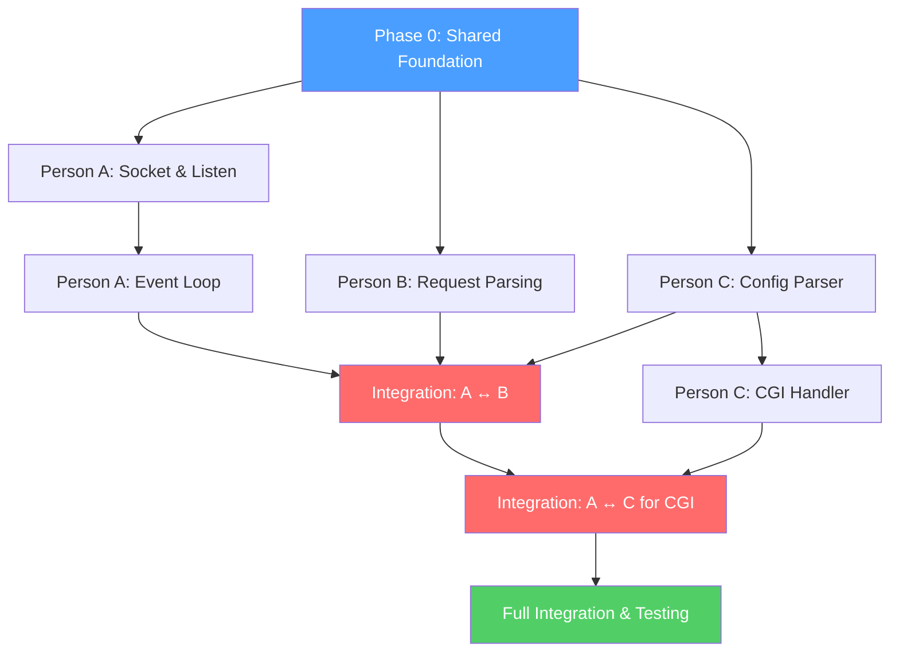

# Webserv — Team Workflow & Task Split (3 People)

## Project Overview

Build a **fully functional HTTP/1.1 web server** in C++98 that handles multiple clients concurrently using non-blocking I/O. The server must support GET, POST, DELETE, CGI execution, virtual hosting, and be configurable via an NGINX-inspired config file.

---

## Team Roles

| Role | Person | Focus Area |
|------|--------|------------|
| **Person A** | _______  | **Core Server & Networking** |
| **Person B** | _______  | **HTTP Protocol & Request/Response** |
| **Person C** | _______  | **Configuration Parser & CGI** |

---

## Phase 0 — Shared Foundation (All 3, Week 1)

> [!IMPORTANT]
> Everyone should complete this phase together before splitting. This ensures a shared understanding of the architecture.

### Tasks
- [x] Agree on **project structure** (directory layout, naming conventions)
- [x] Define **shared interfaces/classes** (see Architecture below)
- [x] Set up the **Makefile** (`all`, `clean`, `fclean`, `re`, `-Wall -Wextra -Werror -std=c++98`)
- [x] Create a basic `.gitignore`
- [x] Write the **README.md** skeleton

### What Everyone Should Learn
| Topic | Why | Resource |
|-------|-----|----------|
| TCP/IP basics | Understand what a socket is | Beej's Guide to Network Programming |
| HTTP/1.1 overview | Understand request/response lifecycle | [RFC 2616](https://www.rfc-editor.org/rfc/rfc2616) (skim sections 4–6, 10, 14) |
| `poll()` / `epoll()` concept | Core I/O multiplexing mechanism | `man 2 poll`, `man 7 epoll` |
| Non-blocking I/O | Why `fcntl(fd, F_SETFL, O_NONBLOCK)` matters | Blog posts + man pages |
| NGINX config basics | Inspiration for your config format | NGINX beginner's guide |

### Proposed Directory Structure
```
Webserv/
├── Makefile
├── README.md
├── config/
│   └── default.conf
├── srcs/
│   ├── main.cpp
│   ├── server/
│   │   ├── Server.cpp / .hpp        # Person A
│   │   ├── Socket.cpp / .hpp        # Person A
│   │   └── EventLoop.cpp / .hpp     # Person A
│   ├── http/
│   │   ├── Request.cpp / .hpp       # Person B
│   │   ├── Response.cpp / .hpp      # Person B
│   │   ├── Router.cpp / .hpp        # Person B
│   │   └── ErrorPages.cpp / .hpp    # Person B
│   ├── config/
│   │   ├── ConfigParser.cpp / .hpp  # Person C
│   │   └── ServerConfig.cpp / .hpp  # Person C
│   ├── cgi/
│   │   └── CgiHandler.cpp / .hpp    # Person C
│   └── utils/
│       └── Utils.cpp / .hpp         # Shared
└── www/                             # Test website files
    ├── index.html
    ├── error/
    │   ├── 404.html
    │   └── 500.html
    └── uploads/
```

---

## Person A — Core Server & Networking

### Responsibilities
Build the **engine** — the socket layer, the event loop, and connection management. Everything that makes the server accept, read, write, and close connections.

### Phase 1 — Socket & Listening (Week 1–2)
- [x] Create `Socket` class: bind, listen, set non-blocking
- [x] Support **multiple listening ports** (one socket per port)
- [x] Handle `SO_REUSEADDR` and `SO_REUSEPORT`
- [x] Test: server listens on configured ports, accepts `telnet` connections

### Phase 2 — Event Loop (Week 2–3)
- [x] Implement the **single poll/epoll loop** for all I/O
- [x] Register listening sockets → accept new clients
- [x] Register client sockets → track read/write readiness
- [x] Implement **connection timeout** (drop idle clients)
- [x] Handle client disconnections gracefully (no crashes, no leaks)
- [x] Test: multiple simultaneous `telnet` or `curl` connections

### Phase 3 — Integration (Week 3–4)
- [x] When data is ready to read → pass raw data to **Person B**'s `Request` parser
- [x] When response is ready → write **Person B**'s `Response` buffer to client
- [x] Support **chunked writing** (large responses sent over multiple poll cycles)
- [x] Integrate with **Person C**'s config (which ports to listen on, server blocks)

### Phase 4 — Hardening (Week 4–5)
- [x] Stress test with `siege` or `ab` (Apache Bench)
- [x] Ensure no file descriptor leaks
- [x] Verify `client_max_body_size` enforcement (reject oversized requests)
- [x] Test with a real browser (Chrome/Firefox)

### What Person A Should Learn

| Topic | Depth | Key Resources |
|-------|-------|---------------|
| `socket()`, `bind()`, `listen()`, `accept()` | Deep | `man 2 socket`, Beej's Guide |
| `poll()` or `epoll()` | Deep | `man 2 poll`, `man 7 epoll` |
| `fcntl()` with `O_NONBLOCK` | Medium | `man 2 fcntl` |
| `send()` / `recv()` | Deep | `man 2 send`, `man 2 recv` |
| `setsockopt()` | Medium | `SO_REUSEADDR`, `SO_REUSEPORT` |
| File descriptor management | Deep | Avoid leaks, `close()` on cleanup |
| Signals (`SIGPIPE`, `SIGINT`) | Medium | `signal()` or `sigaction()` |
| C++98 class design (OOP, RAII) | Medium | Orthodox Canonical Form |

> [!TIP]
> Start with a **minimal echo server** that accepts a connection, reads data, and echoes it back. Then add `poll()`. Then add multi-client support.

---

## Person B — HTTP Protocol & Request/Response

### Responsibilities
Parse raw HTTP requests into structured objects, route them to the right handler, build proper HTTP responses, and serve static files.

### Phase 1 — Request Parsing (Week 1–2)
- [x] Parse **request line**: `GET /path HTTP/1.1`
- [x] Parse **headers**: `Host`, `Content-Length`, `Content-Type`, `Transfer-Encoding`, `Connection`
- [x] Parse **body**: regular body and chunked transfer encoding (`Transfer-Encoding: chunked`)
- [x] Validate method is one of: `GET`, `POST`, `DELETE`
- [x] Handle malformed requests → return `400 Bad Request`
- [x] Test: manually craft raw HTTP requests via `telnet`

### Phase 2 — Response Building (Week 2–3)
- [x] Build `Response` class: status line + headers + body
- [x] Implement **status codes**: 200, 201, 204, 301, 302, 400, 403, 404, 405, 413, 500
- [x] Set `Content-Type` based on file extension (MIME types: `.html`, `.css`, `.js`, `.jpg`, `.png`, etc.)
- [x] Set `Content-Length` header
- [x] Default and custom **error pages** (from config)

### Phase 3 — Routing & Static File Serving (Week 3–4)
- [x] Implement `Router`: match request URI to a **location block** (from Person C's config)
- [x] Serve **static files** from the configured `root` directory
- [x] Handle **directory listing** (`autoindex on/off`)
- [x] Serve **default index file** (e.g., `index.html`) for directory requests
- [x] Handle **HTTP redirections** (301/302 from config)
- [x] Enforce **allowed methods** per location (return `405` if method not allowed)

### Phase 4 — File Uploads & DELETE (Week 3–4)
- [x] Handle `POST` requests with `multipart/form-data` → save uploaded files
- [x] Handle `DELETE` requests → remove specified resource
- [x] Respect `client_max_body_size` → return `413 Payload Too Large`

### Phase 5 — Virtual Hosting (Week 4–5)
- [x] Route requests to the correct **server block** based on `Host` header and `server_name`
- [x] Implement default server fallback
- [x] Test with multiple `server_name` values on the same port

### What Person B Should Learn

| Topic | Depth | Key Resources |
|-------|-------|---------------|
| HTTP/1.1 request format | Deep | [RFC 2616 §4-6](https://www.rfc-editor.org/rfc/rfc2616) |
| HTTP status codes | Deep | [RFC 2616 §10](https://www.rfc-editor.org/rfc/rfc2616#section-10) |
| MIME types | Medium | `Content-Type` mapping |
| Chunked Transfer Encoding | Deep | [RFC 2616 §3.6.1](https://www.rfc-editor.org/rfc/rfc2616#section-3.6.1) |
| `multipart/form-data` | Medium | [RFC 2388](https://www.rfc-editor.org/rfc/rfc2388) |
| URL encoding / decoding | Medium | `%20`, query strings |
| File I/O in C++ | Medium | `std::ifstream`, `stat()`, `opendir()` |
| Virtual hosting | Medium | `Host` header, `server_name` matching |

> [!TIP]
> Use `curl -v` extensively — it shows you the exact request/response exchange. Also use browser DevTools Network tab to observe real HTTP traffic.

---

## Person C — Configuration Parser & CGI

### Responsibilities
Parse the NGINX-inspired configuration file and implement CGI execution for dynamic content (e.g., PHP, Python scripts).

### Phase 1 — Configuration Parser (Week 1–2)
- [x] Design the **config file format** (NGINX-like `server {}` and `location {}` blocks)
- [x] Parse into a `ServerConfig` struct/class containing:
  - `listen` (port)
  - `server_name` (hostname)
  - `root` (document root)
  - `index` (default file)
  - `error_page` (custom error pages)
  - `client_max_body_size`
  - `location` blocks with:
    - `allowed_methods`
    - `root` / `alias`
    - `autoindex` (on/off)
    - `index`
    - `return` (redirections)
    - `cgi_extension` / `cgi_path`
    - `upload_store`
- [x] Handle **default values** for missing directives
- [x] Handle **multiple server blocks**
- [x] Validate config (error on invalid directives, missing required fields)
- [x] Test: parse various config files, print parsed structure

### Example Config File
```nginx
server {
    listen 8080;
    server_name localhost;
    root /var/www/html;
    index index.html;
    client_max_body_size 10M;

    error_page 404 /error/404.html;
    error_page 500 /error/500.html;

    location / {
        allowed_methods GET POST;
        autoindex off;
    }

    location /upload {
        allowed_methods GET POST DELETE;
        upload_store /var/www/uploads;
    }

    location /cgi-bin {
        allowed_methods GET POST;
        cgi_extension .py;
        cgi_path /usr/bin/python3;
    }

    location /redirect {
        return 301 https://example.com;
    }
}

server {
    listen 8081;
    server_name api.localhost;
    root /var/www/api;
}
```

### Phase 2 — CGI Handler (Week 2–4)
- [x] Implement `CgiHandler` class
- [x] Detect CGI requests by **file extension** (e.g., `.py`, `.php`)
- [x] Set up CGI **environment variables**:
  - `REQUEST_METHOD`, `QUERY_STRING`, `CONTENT_TYPE`, `CONTENT_LENGTH`
  - `SCRIPT_NAME`, `PATH_INFO`, `PATH_TRANSLATED`
  - `SERVER_NAME`, `SERVER_PORT`, `SERVER_PROTOCOL`
  - `HTTP_*` (forwarded headers)
- [x] Execute CGI via `fork()` + `execve()`
- [x] Pipe request body to CGI's `stdin` (for POST)
- [x] Read CGI's `stdout` for the response
- [x] Parse CGI output headers (e.g., `Content-Type`, `Status`)
- [x] Handle **CGI timeout** (kill process if it runs too long)
- [x] Make CGI execution **non-blocking** (integrate with Person A's event loop)
- [x] Handle chunked request bodies (un-chunk before sending to CGI)
- [x] Test with a Python CGI script and/or PHP-CGI

### Phase 3 — Integration & Edge Cases (Week 4–5)
- [x] Provide config data to Person A (ports, server blocks) and Person B (routes, locations)
- [x] Test CGI with a real browser (form submission → PHP/Python processing)
- [x] Ensure CGI child processes are properly reaped (`waitpid`)
- [x] Handle CGI errors gracefully (return `500` on failure)

### What Person C Should Learn

| Topic | Depth | Key Resources |
|-------|-------|---------------|
| String parsing in C++ | Deep | `std::string`, `std::istringstream` |
| File I/O (`std::ifstream`) | Medium | Reading config files |
| `fork()` and `execve()` | Deep | `man 2 fork`, `man 2 execve` |
| `pipe()` and `dup2()` | Deep | `man 2 pipe`, `man 2 dup2` |
| `waitpid()` | Medium | `man 2 waitpid`, `WNOHANG` |
| CGI specification | Deep | [CGI/1.1 RFC 3875](https://www.rfc-editor.org/rfc/rfc3875) |
| Environment variables | Medium | `setenv()`, `environ` |
| NGINX config syntax | Medium | NGINX docs for inspiration |
| Process management | Medium | Zombie processes, `SIGCHLD` |

> [!TIP]
> Write a simple Python CGI test script early:
> ```python
> #!/usr/bin/env python3
> print("Content-Type: text/html\r\n\r\n")
> print("<h1>CGI Works!</h1>")
> ```
> This lets you test your CGI handler independently.

---

## Dependency Graph



---

## Timeline (5–6 Weeks)

| Week | Person A | Person B | Person C |
|------|----------|----------|----------|
| **1** | Shared foundation + Echo server | Shared foundation + HTTP study | Shared foundation + Config format design |
| **2** | Sockets + Event loop (poll) | Request parser + Response builder | Config parser implementation |
| **3** | Multi-client handling + timeouts | Routing + Static file serving | CGI handler (fork/execve/pipe) |
| **4** | **Integration with B** (read→parse→respond→write) | File uploads + DELETE + error pages | **Integration with A** (non-blocking CGI) |
| **5** | Stress testing + FD leak checks | Virtual hosting + browser compat | CGI edge cases + config validation |
| **6** | **Full team integration, testing, README, eval prep** | | |

---

## Integration Checkpoints

> [!WARNING]
> These are critical sync points. The team must meet and integrate code at these milestones.

### Checkpoint 1 (End of Week 2)
- Person A: Event loop accepts connections, reads raw data
- Person B: Can parse a raw HTTP request string
- Person C: Can parse a config file into a structured object
- **Test**: A reads data → passes to B → B returns parsed request

### Checkpoint 2 (End of Week 3)
- Person A + B: Server receives request, serves a static HTML file
- Person C: CGI handler can execute a Python script standalone
- **Test**: Open `http://localhost:8080/` in a browser → see a web page

### Checkpoint 3 (End of Week 4)
- All three integrated: config drives server behavior, CGI works
- **Test**: Upload a file via browser form, execute a CGI script, see error pages

### Final (End of Week 5–6)
- Stress test, edge cases, browser compatibility, README complete
- **Test with evaluator scenarios**: multiple servers, large uploads, CGI timeouts, bad requests

---

## Testing Checklist

- [ ] `curl -v http://localhost:8080/` → 200 + index.html
- [ ] `curl -v http://localhost:8080/nonexistent` → 404 error page
- [ ] `curl -X POST -d "data" http://localhost:8080/upload` → file saved
- [ ] `curl -X DELETE http://localhost:8080/upload/file.txt` → file deleted
- [ ] `curl http://localhost:8080/cgi-bin/test.py` → CGI output
- [ ] `siege -c 100 -t 10s http://localhost:8080/` → no crashes
- [ ] Multiple server blocks on different ports
- [ ] `client_max_body_size` rejection (413)
- [ ] Chunked transfer encoding
- [ ] Browser renders pages correctly (Chrome + Firefox)
- [ ] No memory leaks (`valgrind`)
- [ ] No file descriptor leaks (`ls /proc/<pid>/fd`)

---

## Bonus — Assessment & Implementation Plan

> [!IMPORTANT]
> The bonus will **NOT be evaluated** unless your mandatory part is **100% perfect**. Only attempt after mandatory is fully stable and tested.

### Difficulty Assessment

| Bonus Feature | Difficulty | Effort | Who |
|---------------|------------|--------|-----|
| **Cookies & Session Management** | 🟡 Medium | ~2–3 days | Person B |
| **Multiple CGI support** (PHP + Python) | 🟢 Easy | ~0.5–1 day | Person C |

### Verdict: ✅ Do the Bonus — It's Worth It

The Webserv bonus is one of the **easier bonuses** across 42 projects. It doesn't require new system-level concepts — it's purely application-level logic built on top of your existing mandatory infrastructure.

---

### Bonus Feature 1: Cookies & Session Management (Person B)

**Why it's medium, not hard:** Cookies are just HTTP headers. Person B already parses and builds headers, so this is adding one more header type plus a simple in-memory store.

#### Implementation Steps
- [ ] Parse `Cookie` header from incoming requests (`Cookie: session_id=abc123; theme=dark`)
- [ ] Build `Set-Cookie` header in responses (`Set-Cookie: session_id=abc123; Path=/; HttpOnly`)
- [ ] Create a `SessionManager` class with a `std::map<std::string, SessionData>`
- [ ] Generate random session IDs (use `rand()` + timestamp, or read from `/dev/urandom`)
- [ ] On first visit → create session, set cookie
- [ ] On subsequent visits → look up session by cookie value
- [ ] Handle session expiry (optional: timeout-based cleanup)

#### What Person B Needs to Learn
| Topic | Resource |
|-------|----------|
| HTTP Cookie spec | [RFC 6265](https://www.rfc-editor.org/rfc/rfc6265) (sections 4–5) |
| `Set-Cookie` syntax | `Set-Cookie: name=value; Path=/; HttpOnly; Max-Age=3600` |
| Session concept | Server-side map keyed by a random token |

#### Test
```bash
# First request — server sets a cookie
curl -v http://localhost:8080/
# Look for: Set-Cookie: session_id=xxxx

# Second request — send cookie back
curl -v -b "session_id=xxxx" http://localhost:8080/
# Server should recognize the session
```

---

### Bonus Feature 2: Multiple CGI Support (Person C)

**Why it's easy:** If your CGI handler already works for one language (e.g., Python), supporting another (e.g., PHP) is just a config mapping change. The `fork()` + `execve()` + `pipe()` logic stays identical.

#### Implementation Steps
- [ ] Support multiple `cgi_extension` / `cgi_path` pairs per location block
- [ ] Config example:
  ```nginx
  location /cgi-bin {
      cgi_extension .py /usr/bin/python3;
      cgi_extension .php /usr/bin/php-cgi;
  }
  ```
- [ ] In `CgiHandler`, look up the correct interpreter based on the file extension
- [ ] Test with both a Python and PHP CGI script

#### Test Scripts
**Python** (`test.py`):
```python
#!/usr/bin/env python3
import os
print("Content-Type: text/html\r\n\r\n")
print("<h1>Python CGI</h1>")
print(f"<p>Method: {os.environ.get('REQUEST_METHOD')}</p>")
```

**PHP** (`test.php`):
```php
<?php
echo "Content-Type: text/html\r\n\r\n";
echo "<h1>PHP CGI</h1>";
echo "<p>Method: " . $_SERVER['REQUEST_METHOD'] . "</p>";
?>
```

```bash
curl http://localhost:8080/cgi-bin/test.py   # → Python output
curl http://localhost:8080/cgi-bin/test.php   # → PHP output
```

---

### Bonus Strategy & Timeline

| When | What | Who |
|------|------|-----|
| After mandatory is **frozen & tested** | Start bonus | All |
| +1 day | Multiple CGI config support | Person C |
| +2–3 days | Cookie parsing + session store | Person B |
| +1 day | Integration testing with bonus features | All |
| **Total bonus time** | **~3–4 days** | |

> [!TIP]
> **Recommended approach:** Finish mandatory → stress test → fix all bugs → create a `mandatory-final` git tag → then start bonus on a separate branch. If bonus breaks anything, you can always fall back.

