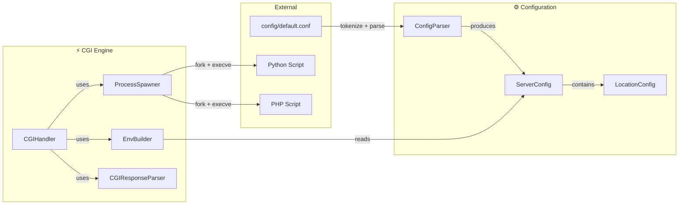
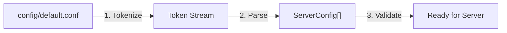
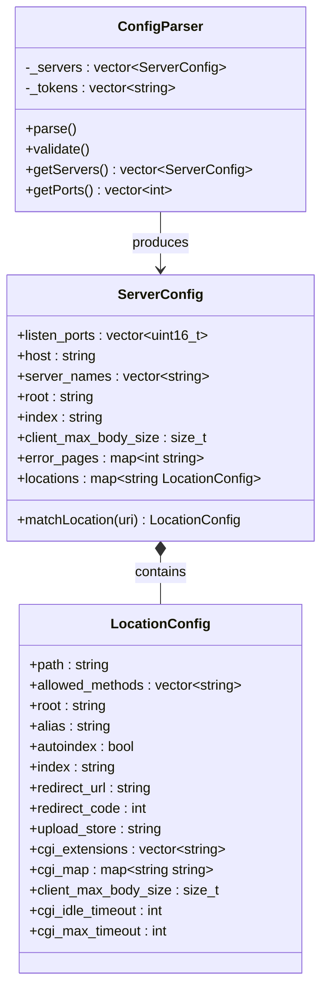
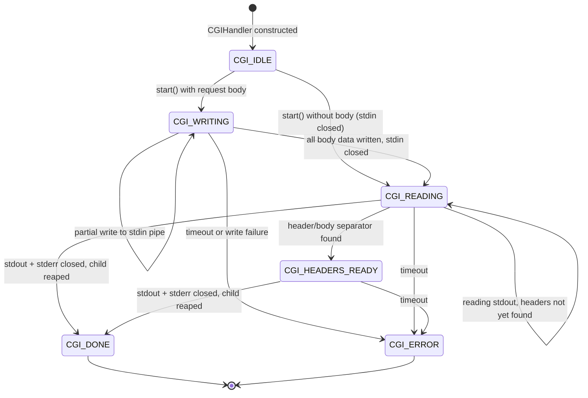
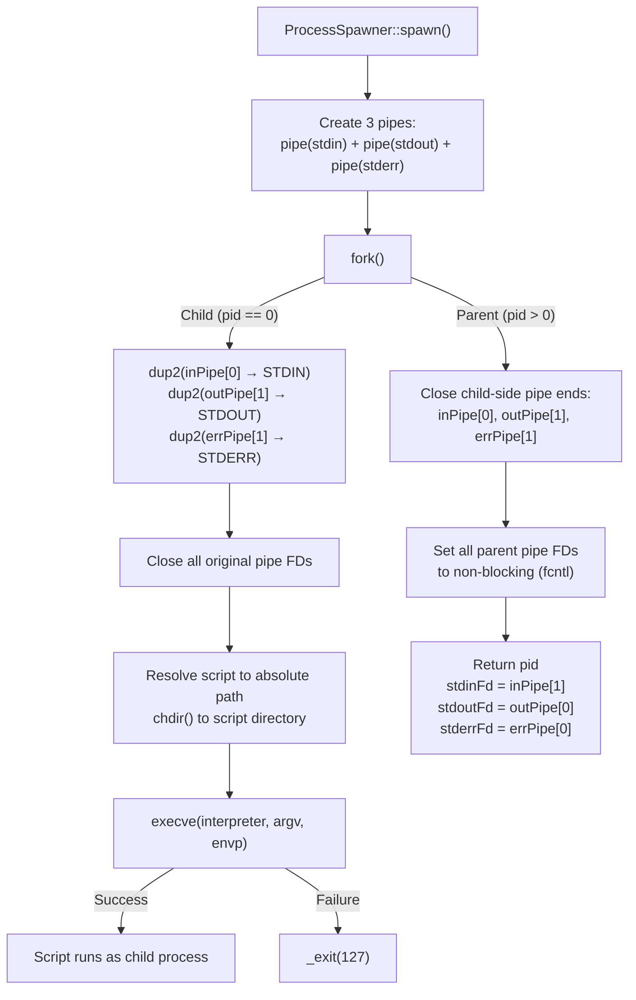
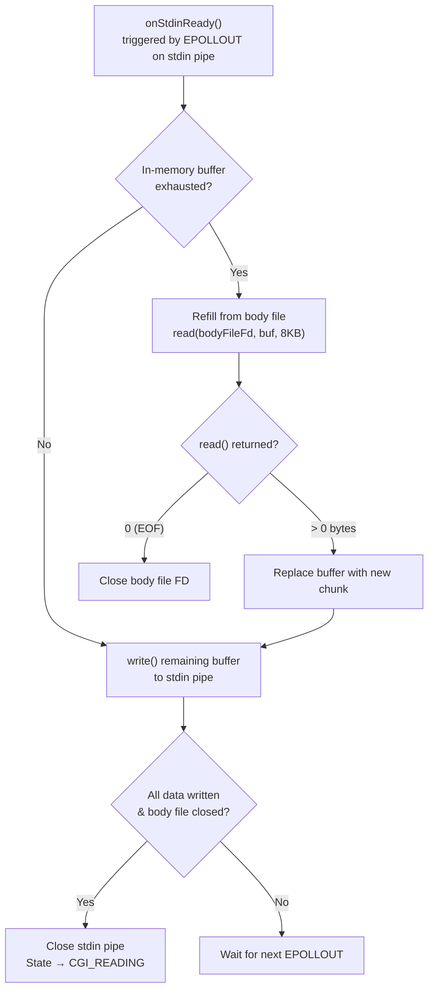
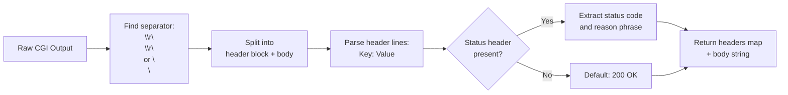
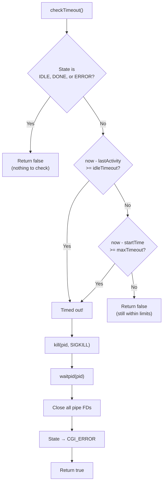
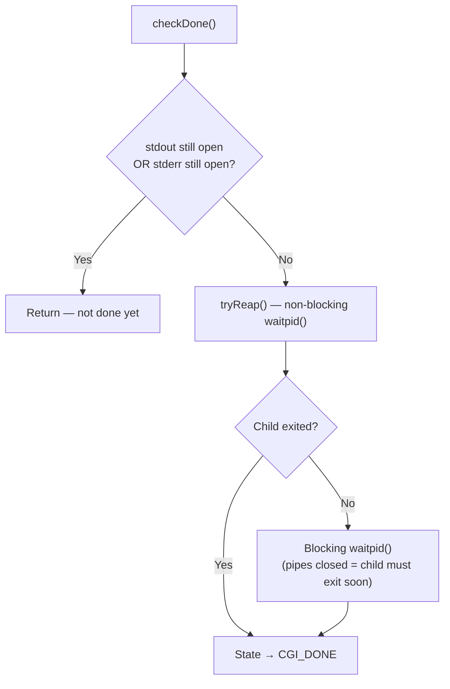

# CGI Engine & Configuration — Architecture

> Technical documentation for the CGI process management and configuration parsing modules of Webserv.  
> This module handles script execution via `fork`/`execve`, environment variable construction, non-blocking pipe I/O, and NGINX-style configuration file parsing.

---

## Table of Contents

1. [Module Overview](#1-module-overview)
2. [Configuration Parser](#2-configuration-parser)
3. [CGI Process Lifecycle](#3-cgi-process-lifecycle)
4. [Environment Variable Builder](#4-environment-variable-builder)
5. [Non-Blocking Pipe I/O](#5-non-blocking-pipe-io)
6. [CGI Response Parsing](#6-cgi-response-parsing)
7. [Timeout Management](#7-timeout-management)
8. [Resource Cleanup & Safety](#8-resource-cleanup--safety)
9. [Design Decisions](#9-design-decisions)

---

## 1. Module Overview

The CGI & Configuration module provides two critical subsystems: a configuration file parser that reads NGINX-style `server {}` blocks at startup, and a CGI engine that executes external scripts (Python, PHP) as child processes with fully non-blocking I/O.



### Source Files

| File | Purpose |
|------|---------|
| [ConfigParser.cpp](srcs/config/ConfigParser.cpp) | Tokenizer and block parser for configuration files |
| [ServerConfig.cpp](srcs/config/ServerConfig.cpp) | Server and location configuration structs |
| [CGIHandler.cpp](srcs/cgi/CGIHandler.cpp) | Non-blocking CGI orchestrator and state machine |
| [ProcessSpawner.cpp](srcs/cgi/ProcessSpawner.cpp) | Process creation wrapper (`pipe` + `fork` + `execve`) |
| [EnvBuilder.cpp](srcs/cgi/EnvBuilder.cpp) | HTTP-to-CGI environment variable translator |
| [CGIResponseParser.cpp](srcs/cgi/CGIResponseParser.cpp) | CGI header parser (separates headers from body) |
| [TempFile.cpp](srcs/cgi/TempFile.cpp) | Temporary file utilities for request body storage |

---

## 2. Configuration Parser

### 2.1 Parsing Pipeline

The configuration file is processed in three sequential stages:



**Stage 1 — Tokenization:** The raw file is split into tokens. Braces (`{`, `}`) and semicolons (`;`) are treated as standalone tokens. All whitespace and comments are stripped.

**Stage 2 — Parsing:** The token stream is consumed by a recursive descent parser. Each `server` token opens a `ServerConfig`, and each `location` token inside opens a `LocationConfig`. Directives are parsed by matching the first token of each statement against known directive names.

**Stage 3 — Validation:** After all blocks are parsed, the validator ensures every `ServerConfig` has at least one `listen` port and that directive values are within acceptable ranges.

### 2.2 Configuration Data Model



### 2.3 Supported Directives

| Scope | Directive | Type | Description |
|-------|-----------|------|-------------|
| Server | `listen` | `uint16_t` | Port number to bind to |
| Server | `server_name` | `string[]` | Virtual host names |
| Server | `root` | `string` | Default document root |
| Server | `index` | `string` | Default index file |
| Server | `client_max_body_size` | `size_t` | Max request body size (supports `M` suffix) |
| Server | `error_page` | `int → string` | Custom error page mapping |
| Location | `allowed_methods` | `string[]` | Permitted HTTP methods |
| Location | `root` / `alias` | `string` | Filesystem path mapping |
| Location | `autoindex` | `bool` | Enable directory listing |
| Location | `upload_store` | `string` | Upload target directory |
| Location | `cgi_extension` | `string` | File extension for CGI scripts |
| Location | `cgi_path` | `string` | Path to CGI interpreter |
| Location | `return` | `int + string` | HTTP redirect |

### 2.4 Error Handling

All parsing errors throw `ConfigParser::ConfigException` with a descriptive message. The exception is caught in `main()` and results in a clean exit with an error message — the server never starts with an invalid configuration.

---

## 3. CGI Process Lifecycle

### 3.1 State Machine

The CGIHandler tracks each script execution through 6 states:



### 3.2 Process Spawning

The `ProcessSpawner` class encapsulates the UNIX process creation sequence:



> [!NOTE]
> **Why `chdir()` to the script directory?** CGI scripts often use relative paths to access files (e.g., templates, databases). Without `chdir()`, the script's working directory would be the server's root, causing relative path lookups to fail.

### 3.3 Pipe Architecture

After `fork()`, the parent and child communicate through three unidirectional pipes:

```
 Parent (Server)                          Child (CGI Script)
 ┌────────────────┐                      ┌────────────────┐
 │                │  ── stdinPipe ──►    │ STDIN           │
 │  CGIHandler    │                      │                │
 │                │  ◄── stdoutPipe ──   │ STDOUT          │
 │                │                      │                │
 │                │  ◄── stderrPipe ──   │ STDERR          │
 └────────────────┘                      └────────────────┘
       │                                        │
       ▼                                        ▼
  All pipe FDs set                     dup2() redirects
  to O_NONBLOCK                        stdin/stdout/stderr
  and registered                       to pipe endpoints
  in epoll
```

> [!IMPORTANT]
> All parent-side pipe FDs are set to `O_NONBLOCK` and registered into the EventLoop's `epoll` instance. This means the server never blocks waiting for a CGI script — it continues serving other clients while the script runs.

---

## 4. Environment Variable Builder

The `EnvBuilder` translates HTTP request data into CGI/1.1 environment variables as defined by [RFC 3875](https://datatracker.ietf.org/doc/html/rfc3875).

### 4.1 Variable Categories

| Category | Variables | Source |
|----------|----------|--------|
| **Request Metadata** | `REQUEST_METHOD`, `REQUEST_URI`, `QUERY_STRING`, `SERVER_PROTOCOL` | Parsed from HTTP request line |
| **Content Headers** | `CONTENT_TYPE`, `CONTENT_LENGTH` | Extracted from HTTP headers (no `HTTP_` prefix per RFC) |
| **HTTP Headers** | `HTTP_HOST`, `HTTP_ACCEPT`, `HTTP_USER_AGENT`, etc. | All other headers converted with `HTTP_` prefix |
| **Server Info** | `SERVER_NAME`, `SERVER_PORT`, `SERVER_SOFTWARE` | From `ServerConfig` and Host header |
| **Script Info** | `SCRIPT_NAME`, `SCRIPT_FILENAME`, `PATH_INFO`, `PATH_TRANSLATED` | Derived from URI and document root |
| **Client Info** | `REMOTE_ADDR` | Client IP from socket |
| **CGI Protocol** | `GATEWAY_INTERFACE` (`CGI/1.1`), `REDIRECT_STATUS` (`200`) | Fixed values |

### 4.2 Header Name Normalization

HTTP headers are converted to CGI environment variables following the standard convention:

```
HTTP Header:    Content-Type    →  (special: no HTTP_ prefix)  →  CONTENT_TYPE
HTTP Header:    Accept-Language →  HTTP_ + uppercase + _ for - →  HTTP_ACCEPT_LANGUAGE
HTTP Header:    X-Custom-Data   →  HTTP_ + uppercase + _ for - →  HTTP_X_CUSTOM_DATA
```

> [!NOTE]
> **Why no `HTTP_` prefix for `Content-Type` and `Content-Length`?** RFC 3875 §4.1.3 defines `CONTENT_TYPE` and `CONTENT_LENGTH` as standalone meta-variables, not as HTTP header translations. This is because they describe the request entity body, not the HTTP transport layer.

---

## 5. Non-Blocking Pipe I/O

### 5.1 stdin — Streaming Request Body to Script

When a POST request has a body, the CGIHandler streams it to the script's stdin pipe:



> [!NOTE]
> **Streaming, not buffering:** The request body is read from the temporary file in 8KB chunks, not loaded entirely into memory. This keeps memory usage constant regardless of upload size.

### 5.2 stdout — Two-Phase Output Processing

The CGI output is processed in two phases:

**Phase 1 — Header Accumulation (`CGI_READING`):** All output is buffered in `_rawBuffer` until the header/body separator (`\r\n\r\n` or `\n\n`) is found. A 64KB safety limit prevents memory exhaustion from malformed scripts.

**Phase 2 — Body Streaming (`CGI_HEADERS_READY`):** Once headers are parsed, all subsequent output goes directly into the `_outputQueue`. The EventLoop's consumer (`_reloadWriteBuffer`) pulls data from this queue and streams it to the browser using Chunked Transfer Encoding.

### 5.3 stderr — Error Collection

All stderr output is accumulated in the `_error` string. This data is used for logging and debugging but is never sent to the browser.

---

## 6. CGI Response Parsing

The `CGIResponseParser` separates CGI headers from the response body:



**Key behaviors:**
- The `Status` header is case-insensitive (handles `Status`, `status`, `STATUS`)
- If no `Status` header is present, the response defaults to `200 OK`
- Any body bytes that arrive in the same read as the headers are preserved and pushed to the output queue

---

## 7. Timeout Management

The CGIHandler implements a **dual timeout** strategy inspired by production servers:

### 7.1 Two Timeout Types

| Timeout | Inspired By | What It Detects | Behavior |
|---------|-------------|-----------------|----------|
| **Idle Timeout** | NGINX `proxy_read_timeout` | Script produces no output for N seconds | Kills script after inactivity period |
| **Absolute Timeout** | PHP-FPM `request_terminate_timeout` | Script exceeds total wall-clock time | Kills script regardless of activity |



### 7.2 Configurable Per Location

Timeouts can be set per location block in the configuration file:

```nginx
location /cgi-bin {
    cgi_extension .py;
    cgi_path /usr/bin/python3;
    cgi_idle_timeout 30;    # Kill after 30s of inactivity
    cgi_max_timeout 120;    # Kill after 120s total
}
```

> [!NOTE]
> **Why two timeouts instead of one?** A single timeout can't handle all scenarios. A long-running data processing script that continuously outputs progress should not be killed by an idle timeout. But it should still be stopped if it exceeds a maximum total time. Conversely, a script that hangs silently should be caught by the idle timeout long before the absolute limit.

---

## 8. Resource Cleanup & Safety

### 8.1 FD Ownership

| FD | Created By | Closed By |
|----|-----------|-----------|
| `_stdinFd` | `ProcessSpawner::spawn()` | `onStdinReady()` (when all body written) or `cleanup()` |
| `_stdoutFd` | `ProcessSpawner::spawn()` | `onStdoutReady()` (on EOF) or `cleanup()` |
| `_stderrFd` | `ProcessSpawner::spawn()` | `onStderrReady()` (on EOF) or `cleanup()` |
| `_bodyFileFd` | `CGIHandler::start()` | `onStdinReady()` (on EOF) or `cleanup()` |
| Child PID | `fork()` | `checkDone()` / `checkTimeout()` / `cleanup()` via `waitpid()` |

### 8.2 Cleanup Guarantees

The `cleanup()` method is called by the destructor (`~CGIHandler`) and provides the following guarantees:

1. **Process termination:** If the child is still running, it receives `SIGKILL` and is immediately reaped with `waitpid()`. No zombie processes are left behind.
2. **Pipe closure:** All open pipe FDs (`stdin`, `stdout`, `stderr`) and the body file FD are closed.
3. **State reset:** The handler returns to `CGI_IDLE`, ready to be reused for the next request on a keep-alive connection.

> [!WARNING]
> **SIGKILL, not SIGTERM:** The cleanup uses `SIGKILL` (which cannot be caught or ignored) instead of `SIGTERM`. This ensures that even a misbehaving script that ignores signals is forcefully terminated. In a production server, you might send `SIGTERM` first and fall back to `SIGKILL` after a grace period, but for this project's scope, immediate termination is the safer choice.

### 8.3 Completion Detection

A CGI process is considered done only when **both stdout and stderr pipes are closed** (EOF detected on both). This is critical because:
- A script might close stdout but still be writing to stderr
- Calling `waitpid()` before all pipes are drained could discard buffered output



---

## 9. Design Decisions

Summary of key architectural decisions:

| Decision | Rationale | Consequence if Removed |
|----------|-----------|----------------------|
| Non-blocking pipes registered in epoll | CGI I/O handled by the same event loop as HTTP — no threads needed | Server blocks while waiting for CGI scripts |
| Body streamed from file in 8KB chunks | Constant memory usage regardless of POST body size | Large uploads exhaust server memory |
| Two-phase stdout processing (headers then body) | Allows HTTP headers to be built from CGI headers before streaming begins | Cannot set `Content-Type` or status code from CGI output |
| Dual timeout (idle + absolute) | Catches both hanging scripts and runaway long-running scripts | Silent hangs go undetected, or active scripts are killed too early |
| `chdir()` to script directory before `execve()` | Scripts can use relative paths for file access | CGI scripts with relative imports/includes break |
| `SIGKILL` for cleanup (not `SIGTERM`) | Guarantees process termination regardless of signal handlers | Misbehaving scripts ignore `SIGTERM` and become zombies |
| Output queue with offset-based compaction | Avoids expensive string erasure on every `popOutput()` call | Memory fragmentation and O(n) erase on each chunk |
| Tokenizer-based config parser | Clean separation of lexing and parsing stages | Complex regex-based parsing, harder to extend with new directives |
| ConfigException for all parse errors | Fail-fast: server never starts with invalid configuration | Server starts with broken config, crashes at runtime |
| Header size limit (64KB) on CGI output | Prevents memory exhaustion from malformed CGI scripts | Script outputting infinite headers crashes the server |
