# EventLoop & Core Server — Architecture

> Technical documentation for the non-blocking, event-driven core of Webserv.  
> This module handles all network I/O, connection lifecycle management, and CGI process integration using the Linux `epoll` API.

---

## Table of Contents

1. [Class Map](#1-class-map)
2. [Startup Sequence](#2-startup-sequence)
3. [I/O Multiplexing Engine](#3-io-multiplexing-engine)
4. [Socket Initialization](#4-socket-initialization)
5. [Event Loop Lifecycle](#5-event-loop-lifecycle)
6. [Client State Machine](#6-client-state-machine)
7. [Non-Blocking CGI Pipeline](#7-non-blocking-cgi-pipeline)
8. [Module Integration](#8-module-integration)
9. [File Descriptor Ownership & Leak Prevention](#9-file-descriptor-ownership--leak-prevention)
10. [Signal Handling & Graceful Shutdown](#10-signal-handling--graceful-shutdown)
11. [Reference Tables](#11-reference-tables)

---

## 1. Class Map

Complete class hierarchy showing how all modules connect. The `Client` struct is the central integration point — it holds one instance of each module's core object.

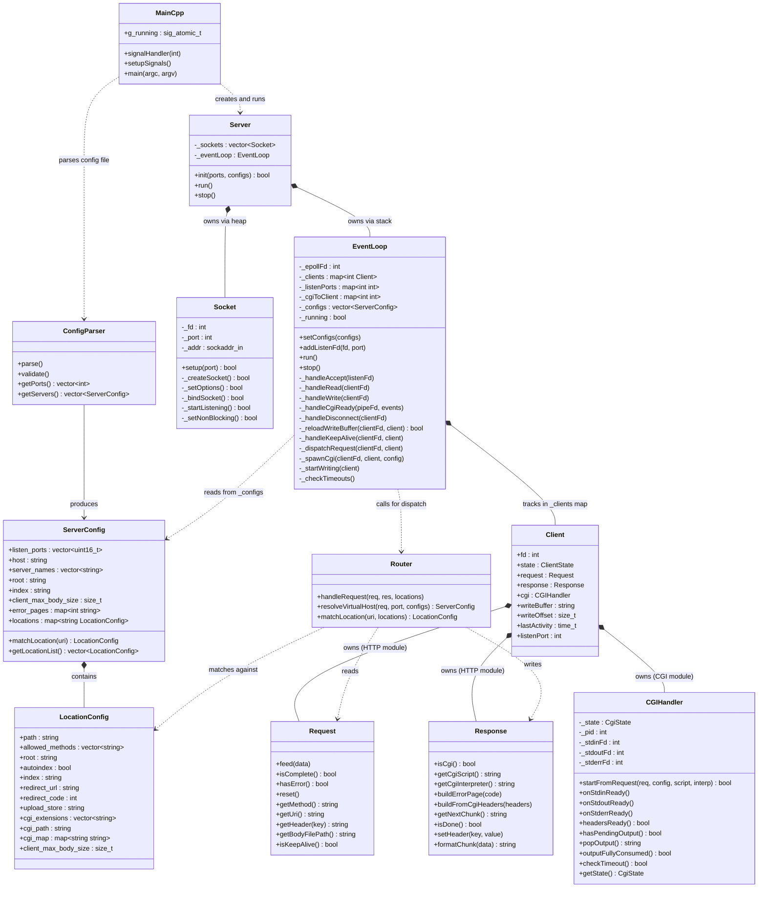

> [!NOTE]
> **Module boundaries:** `Server`, `Socket`, `EventLoop`, and `Client` belong to the core server module (`srcs/server/`). `Request`, `Response`, and `Router` belong to the HTTP module (`srcs/http/`). `ConfigParser`, `ServerConfig`, and `CGIHandler` belong to the configuration and CGI module (`srcs/config/` + `srcs/cgi/`).

---

## 2. Startup Sequence

Traces the exact order of operations from `./webserv config/default.conf` to the first `epoll_wait()` call.

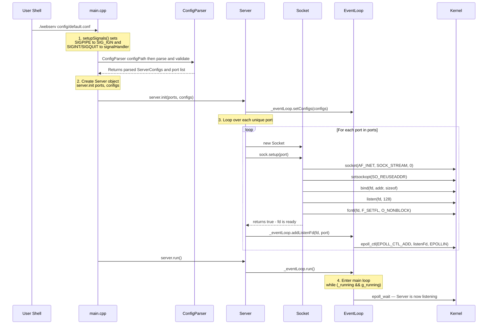

**Key source files:** [main.cpp](srcs/main.cpp) → [Server.cpp](srcs/server/Server.cpp) → [Socket.cpp](srcs/server/Socket.cpp) → [EventLoop.cpp](srcs/server/EventLoop.cpp)

---

## 3. I/O Multiplexing Engine

### Why `epoll` Over `poll` / `select`

| Feature | `select()` | `poll()` | `epoll()` |
|---------|-----------|---------|----------|
| **Complexity per call** | O(N) — scans all FDs | O(N) — scans all FDs | O(1) — returns only ready FDs |
| **FD limit** | 1024 (FD_SETSIZE) | No hard limit | No hard limit |
| **FD registration** | Rebuild `fd_set` every loop | Rebuild `pollfd[]` every loop | Register once with `epoll_ctl` |
| **Kernel mechanism** | Linear scan | Linear scan | Red-Black Tree + Ready List |
| **Scales to** | ~hundreds | ~thousands | ~millions |

**Why this matters for Webserv:** Under `siege -c 250` stress testing, `poll()` would scan 250+ FDs every single loop iteration. `epoll` only wakes up and returns the exact FDs that actually have data ready.

### How `epoll` Works Inside the Kernel

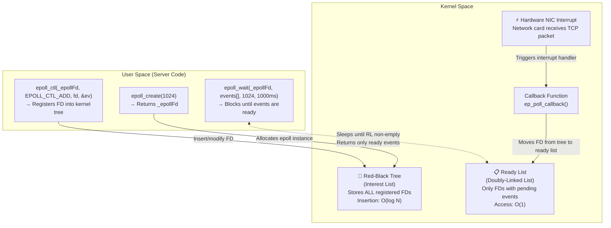

**The key insight:** When data arrives on a socket, the kernel's network card triggers a hardware interrupt. The interrupt handler calls `ep_poll_callback()` which moves that specific FD from the Red-Black Tree to the Ready List. When `epoll_wait()` returns, it copies only the Ready List entries to the `events[]` array — zero scanning.

### The Three `epoll` Syscalls

| Syscall | What It Does | Usage |
|---------|-------------|-------|
| `epoll_create(1024)` | Creates the epoll instance (size hint is ignored in modern kernels but required by the API) | Constructor |
| `epoll_ctl(EPOLL_CTL_ADD)` | Register a new FD to monitor | `_addEpollFd()` |
| `epoll_ctl(EPOLL_CTL_MOD)` | Switch between `EPOLLIN` ↔ `EPOLLOUT` | `_setEpollEvents()` |
| `epoll_ctl(EPOLL_CTL_DEL)` | Remove FD from monitoring | `_removeEpollFd()` |
| `epoll_wait(...)` | Block until events are ready (or timeout) | Main loop |

> [!NOTE]
> **Level-Triggered mode (default)** is used instead of Edge-Triggered. This means `epoll_wait()` keeps reporting a FD as ready as long as there is data in the buffer. This is safer and simpler — there is no need to drain every byte in a single call.

---

## 4. Socket Initialization

Every listening socket goes through exactly **5 sequential syscalls**. If any fails, the chain breaks and the FD is cleaned up via RAII:

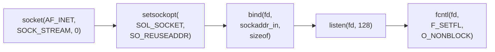

| Syscall | Purpose | What Happens If Missing |
|---------|---------|----------------------|
| `socket()` | Creates a TCP endpoint (IPv4, stream-based) | No network communication possible |
| `setsockopt(SO_REUSEADDR)` | Allow immediate rebind after restart (skip `TIME_WAIT`) | *"Address already in use"* error when restarting server |
| `bind()` | Associates socket with `0.0.0.0:port` — `htonl(INADDR_ANY)` binds to all interfaces | Socket exists but isn't attached to any network address |
| `listen(fd, 128)` | Marks socket as passive (accepting connections). Backlog=128 means kernel queues up to 128 pending `SYN` handshakes | `accept()` would fail — socket isn't in listening state |
| `fcntl(O_NONBLOCK)` | Makes `accept()` return `EAGAIN` instead of blocking when no connections pending | `accept()` on listener blocks entire server |

---

## 5. Event Loop Lifecycle

Complete flowchart of `EventLoop::run()` — the heart of the server:

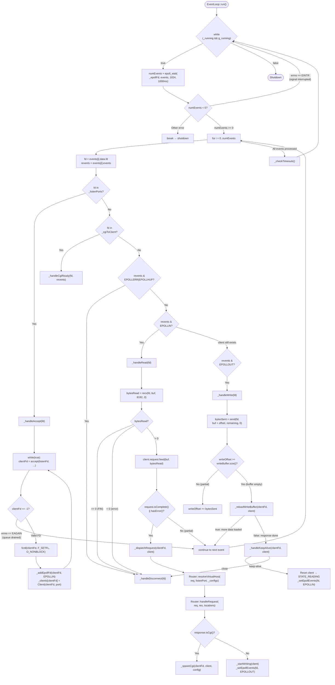

---

## 6. Client State Machine

Each client connection is tracked by a `Client` struct with 4 active states defined in the `ClientState` enum:

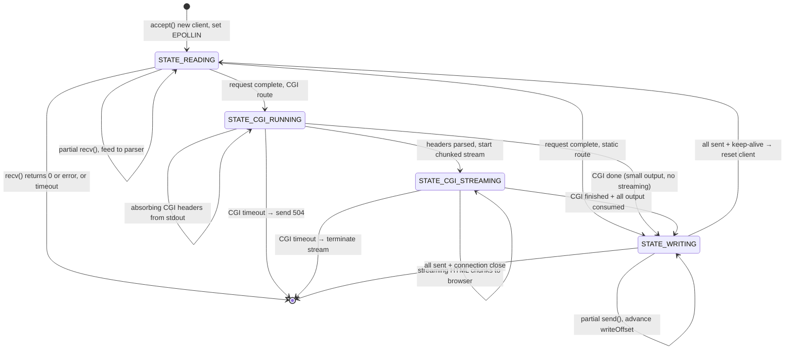

### Buffer Management: How Partial I/O Works

```
 Client struct (per connection)
 ┌─────────────────────────────────────────────────────────────┐
 │ fd = 7                                                      │
 │ listenPort = 8080                                           │
 │ state = STATE_WRITING                                       │
 │ lastActivity = 1752659145                                   │
 │                                                             │
 │ request (HTTP module):                                      │
 │   ┌─ _buffer: accumulated raw bytes from recv() calls       │
 │   ├─ _state: REQUEST_LINE → HEADERS → BODY → COMPLETE      │
 │   └─ feed(): appends new data, advances parser state        │
 │                                                             │
 │ response (HTTP module):                                     │
 │   ┌─ getNextChunk(): returns next piece of response         │
 │   └─ isDone(): true when all chunks sent                    │
 │                                                             │
 │ writeBuffer = "HTTP/1.1 200 OK\r\n..."  ← current chunk    │
 │ writeOffset = 4096  ← bytes already sent from this chunk    │
 │              ▲                                              │
 │              │ send() returned 4096 on the last EPOLLOUT    │
 │              │ Next send() starts from writeBuffer + 4096   │
 │                                                             │
 │ cgi (CGI module):                                           │
 │   ┌─ _stdinFd / _stdoutFd / _stderrFd: pipe endpoints      │
 │   ├─ _pid: child process PID                                │
 │   └─ _state: CGI_IDLE → CGI_RUNNING → CGI_DONE             │
 └─────────────────────────────────────────────────────────────┘
```

---

## 7. Non-Blocking CGI Pipeline

The most complex subsystem in the core server. The key design decision: **CGI pipe FDs are registered into the same `epoll` instance as client sockets**, so the event loop never blocks waiting for a CGI script.

### Step 1: Spawning the CGI Process

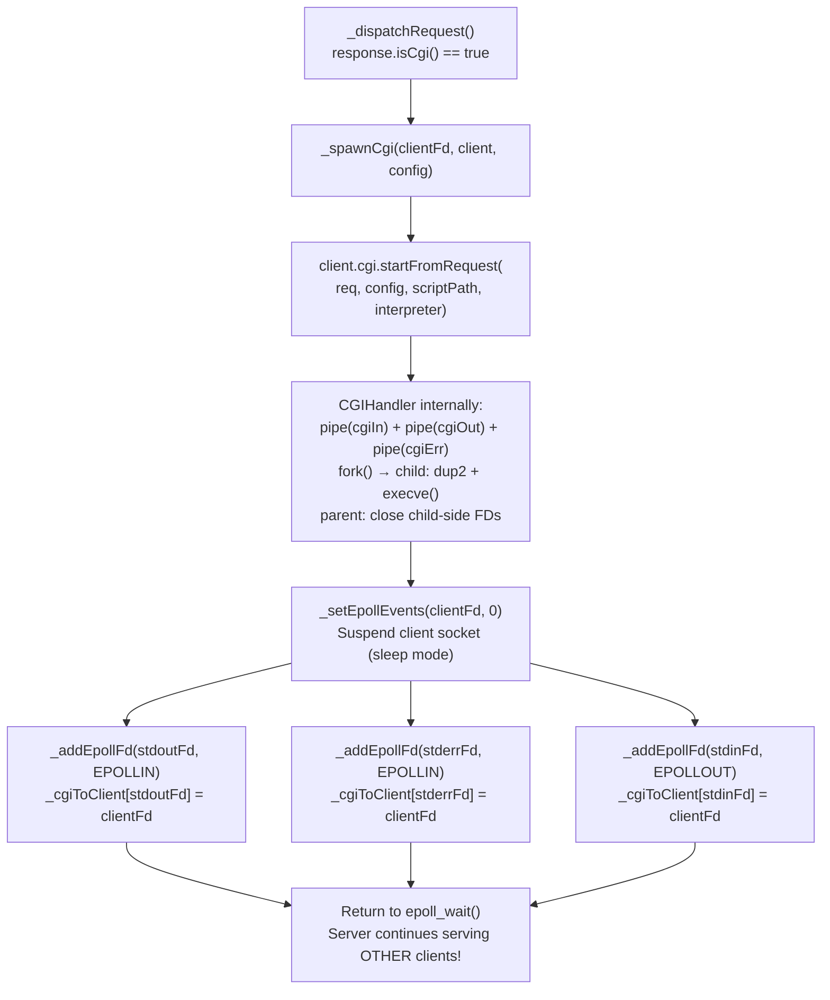

> [!NOTE]
> **Why `_setEpollEvents(clientFd, 0)` instead of removing from epoll?**  
> Setting events to `0` keeps the FD in epoll but disables `EPOLLIN` and `EPOLLOUT`. The kernel **always** forces `EPOLLERR` and `EPOLLHUP` — so if the client closes their browser during CGI execution, the server still detects it and cleans up.

### Step 2: The CGI State Machine (Headers vs Body)

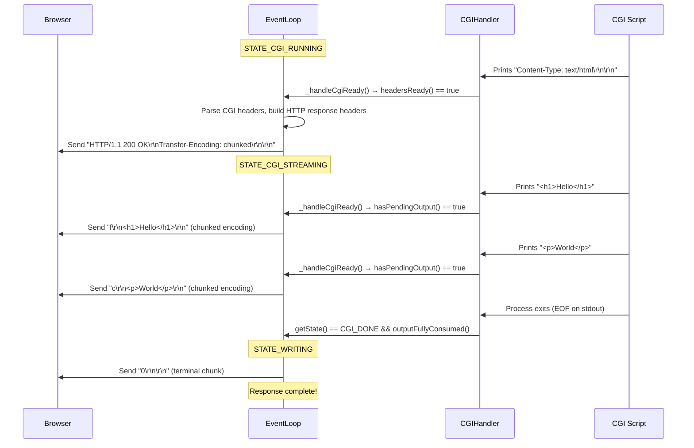

**The two CGI states explained:**
- **`STATE_CGI_RUNNING`:** The server is absorbing data from the CGI script but NOT sending anything to the browser. It is searching for the `\r\n\r\n` that separates CGI headers from the body.
- **`STATE_CGI_STREAMING`:** The headers are parsed. Everything the script prints from now on is content. The server wraps it in Chunked Transfer Encoding and streams it directly to the browser.

### Step 3: Producer-Consumer Data Flow

The CGI data flow follows a **Producer-Consumer** pattern between two different epoll events:

| Role | Function | Triggered By | What It Does |
|------|----------|-------------|-------------|
| **Producer** | `_handleCgiReady()` | `EPOLLIN` on CGI pipe | Reads output from CGI script, stores in buffer, wakes up network socket |
| **Consumer** | `_reloadWriteBuffer()` | `EPOLLOUT` on client socket | Pulls data from buffer, formats as HTTP chunk, sends to browser |

**Scenario A — Network faster than CGI script:**
The script is slow. The Consumer sends data faster than the Producer generates it. When the buffer empties, `_reloadWriteBuffer()` puts the client socket to sleep (`_setEpollEvents(clientFd, 0)`). When the script finally prints more, `_handleCgiReady()` wakes it back up.

**Scenario B — CGI script faster than network:**
The script floods 100 chunks instantly. The Producer stores them all in memory. The Consumer slowly drains them one by one as the network allows, without needing the Producer to wake it up.

### Step 4: CGI Timeout Handling

If a CGI script hangs (infinite loop, deadlock), `_checkTimeouts()` detects and terminates it:

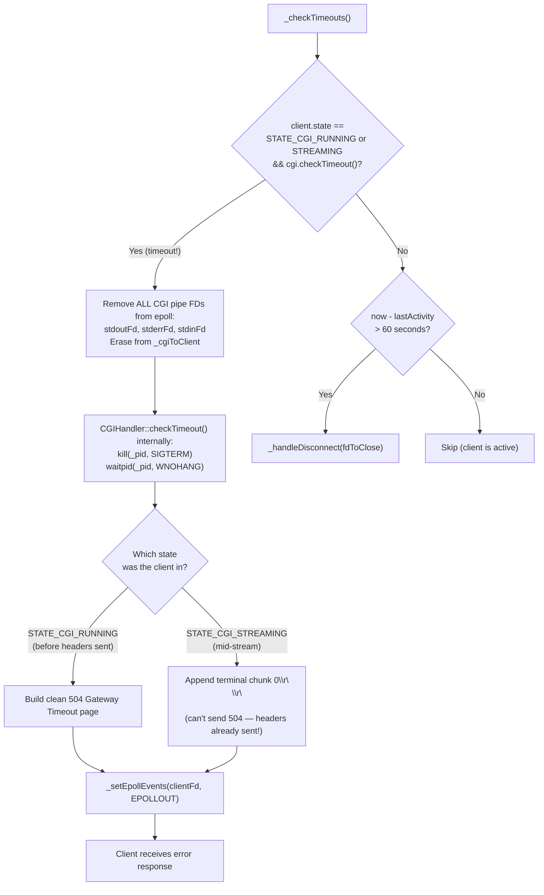

> [!WARNING]
> **Iterator invalidation:** When disconnecting an idle client inside the timeout loop, the FD must be saved, the iterator advanced with `++it`, and only then `_handleDisconnect()` called. Deleting the current iterator first would cause a segmentation fault on `++it`.

---

## 8. Module Integration

This diagram shows exactly where the core server module calls the HTTP and CGI modules, and what data flows between them:

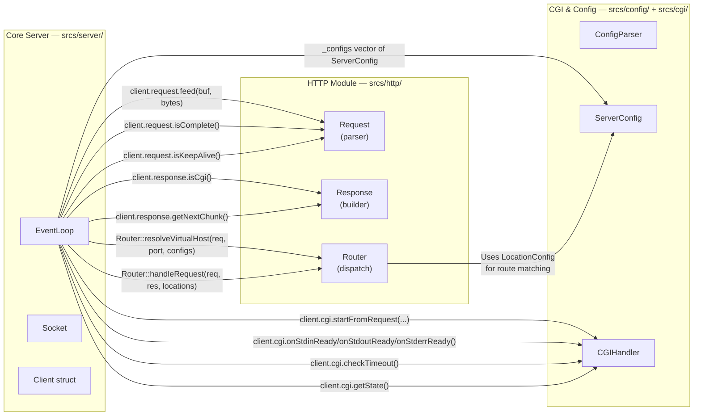

### Integration Contracts

| When the EventLoop calls... | Expected return | Purpose |
|---|---|---|
| `request.feed(data)` | Parser accumulates bytes internally | Streaming request parsing |
| `request.isComplete()` | `true` when full HTTP request is parsed | Triggers dispatch |
| `Router::resolveVirtualHost()` | Pointer to matching `ServerConfig` by `Host` header + port | Virtual hosting |
| `Router::handleRequest()` | `Response` object populated (static file, error, or CGI flag) | Request routing |
| `response.isCgi()` | `true` if route matched a CGI extension | CGI vs static branching |
| `response.getNextChunk()` | Next piece of serialized HTTP response (headers + body chunk) | Streaming response |
| `cgi.startFromRequest()` | `true` if fork+execve succeeded; pipe FDs are now valid | CGI process creation |
| `cgi.onStdoutReady()` | Reads available data from CGI stdout pipe (non-blocking) | CGI output collection |
| `cgi.getState()` | `CGI_DONE` or `CGI_ERROR` when process finished | CGI lifecycle tracking |

---

## 9. File Descriptor Ownership & Leak Prevention

> [!IMPORTANT]
> File descriptor leaks are a common failure point in long-running servers. Every FD type has exactly one owner responsible for closing it.

```
 FD Type              Owner              Created At                    Closed At
 ─────────────────────────────────────────────────────────────────────────────────
 _epollFd             EventLoop          EventLoop() constructor       ~EventLoop() destructor

 listenFd             Socket             Socket::_createSocket()       Socket::~Socket()

 clientFd             EventLoop          accept() in _handleAccept     _handleDisconnect()
                      (_clients map)                                   OR ~EventLoop()

 cgiStdinFd           CGIHandler         pipe() in CGIHandler::start   CGIHandler::onStdinReady()
 cgiStdoutFd                                                           when EOF detected
 cgiStderrFd                                                           OR CGIHandler::cleanup()
                                                                       OR CGIHandler::checkTimeout()
```

### Leak Prevention Guarantees

| Scenario | What Happens |
|----------|-------------|
| Client sends `FIN` (clean close) | `recv()` returns `0` → `_handleDisconnect(fd)` → `close(fd)` + erase from maps |
| Client crashes / network error | `EPOLLERR` or `EPOLLHUP` event → `_handleDisconnect(fd)` |
| Client goes silent (half-open) | `_checkTimeouts()` detects `now - lastActivity > 60s` → `_handleDisconnect(fd)` |
| CGI hangs forever | `cgi.checkTimeout()` kills child, closes pipes → `buildErrorPage(504)` |
| Client disconnects during CGI | `_handleDisconnect()` checks `STATE_CGI_RUNNING` → removes all pipe FDs from epoll and `_cgiToClient` |
| Server receives `SIGINT` (Ctrl+C) | `g_running = 0` → loop exits → `~EventLoop()` closes all remaining client FDs + `_epollFd` |
| Socket setup fails mid-way | Each `Socket::_*()` method returns false → `setup()` short-circuits → destructor closes `_fd` (RAII) |

---

## 10. Signal Handling & Graceful Shutdown

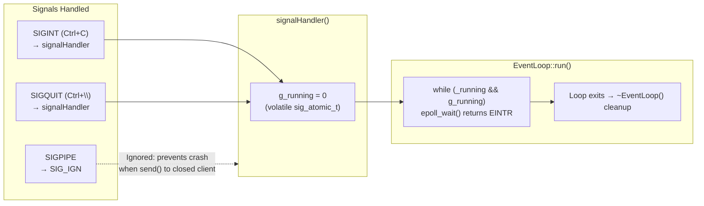

**Why `SIGPIPE` is ignored:** If a client disconnects while the server is `send()`ing data, the kernel sends `SIGPIPE` to the process. The default action is to **terminate the process**. By ignoring it, `send()` simply returns `-1` with `errno == EPIPE`, which `_handleWrite()` catches and handles gracefully via `_handleDisconnect()`.

---

## 11. Reference Tables

### Constants

| Constant | Value | Purpose |
|----------|-------|---------|
| `EPOLL_TIMEOUT_MS` | 1000 | `epoll_wait` wakes every 1s even without events (for timeout checks) |
| `CLIENT_TIMEOUT_SEC` | 60 | Close clients idle for 60 seconds |
| `READ_BUFFER_SIZE` | 8192 | Stack buffer for `recv()` — one read per event cycle |
| `EPOLL_SIZE` | 1024 | Hint to `epoll_create()` (ignored by modern kernels) |
| `MAX_EVENTS` | 1024 | Max events returned per `epoll_wait()` call |
| Listen backlog | 128 | Max pending TCP handshakes in kernel queue |

### Internal Data Structures

| Map | Key → Value | Purpose |
|-----|------------|---------|
| `_clients` | `clientFd → Client` | Tracks all active connections and their state |
| `_listenPorts` | `listenFd → port` | Identifies which FDs are listeners (for `_handleAccept`) |
| `_cgiToClient` | `pipeFd → clientFd` | Maps CGI pipe FDs back to their owning client |

### Event Dispatch Table

| Event Flag | Meaning | Handler |
|-----------|---------|---------|
| `EPOLLIN` on listener | New connection pending | `_handleAccept()` |
| `EPOLLIN` on client | Data ready to read | `_handleRead()` |
| `EPOLLOUT` on client | Socket ready for writing | `_handleWrite()` |
| `EPOLLERR \| EPOLLHUP` | Connection error or hangup | `_handleDisconnect()` |
| `EPOLLIN` on CGI pipe | CGI stdout/stderr has data | `_handleCgiReady()` |
| `EPOLLOUT` on CGI pipe | CGI stdin ready for write | `_handleCgiReady()` |

### Function Reference

| Function | Responsibility |
|----------|---------------|
| `_handleAccept()` | Drain accept queue, set non-blocking, register in epoll |
| `_handleRead()` | Single recv(), feed parser, dispatch when complete |
| `_handleWrite()` | Single send(), delegate to reload/keepalive helpers |
| `_reloadWriteBuffer()` | CGI chunk streaming & file streaming buffer refill |
| `_handleKeepAlive()` | Reset client for next request or disconnect |
| `_handleCgiReady()` | Route pipe events, manage CGI state machine |
| `_handleDisconnect()` | Clean up CGI pipes + client FD + maps |
| `_spawnCgi()` | Fork/exec, register pipes in epoll |
| `_checkTimeouts()` | Kill zombie CGIs, disconnect idle clients |
