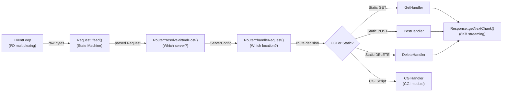
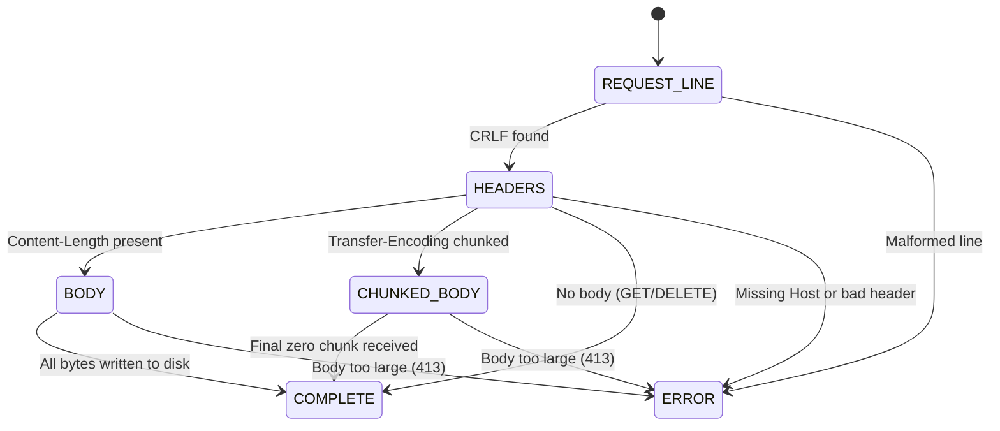
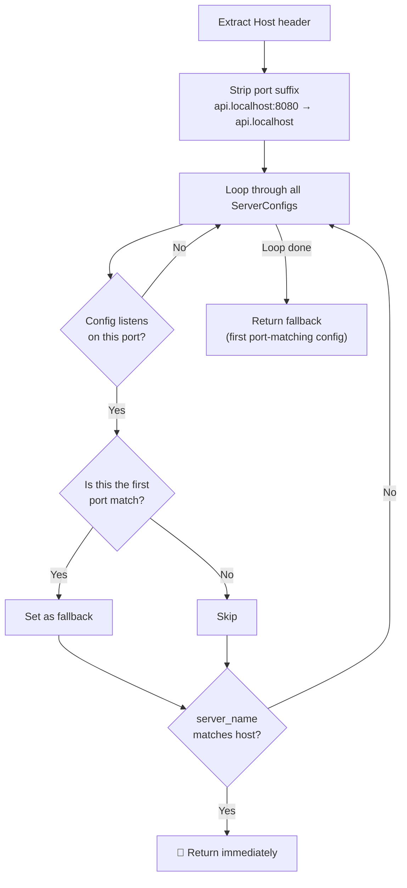
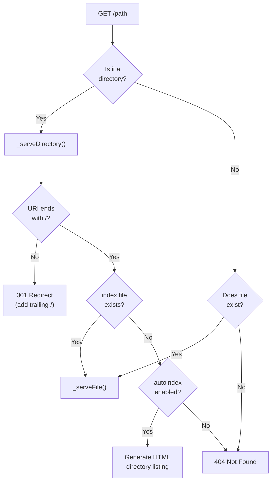
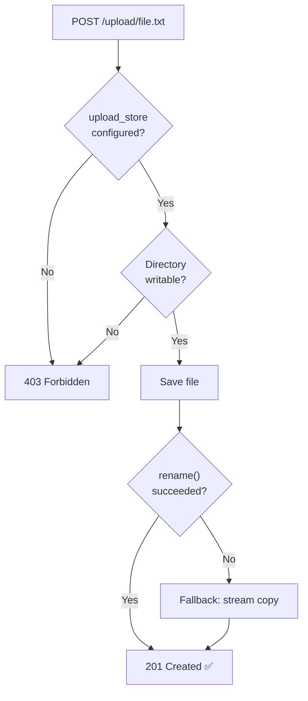
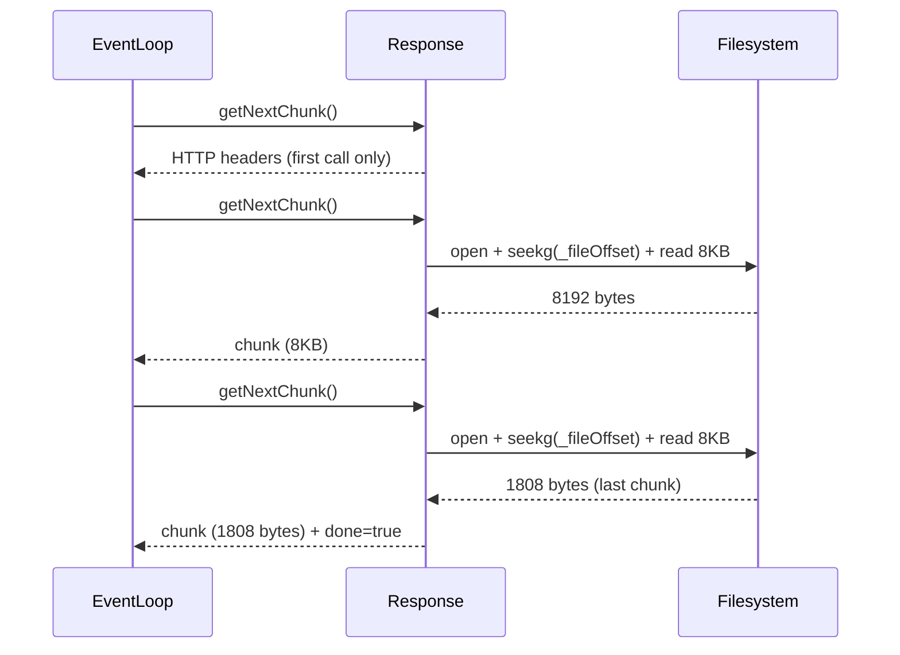

# HTTP Protocol Layer — Architecture

> Technical documentation for the HTTP request parsing, routing, and response streaming module of Webserv.  
> This module handles all HTTP/1.1 protocol logic — from raw bytes to fully formed responses.

---

## Table of Contents

1. [Module Overview](#1-module-overview)
2. [Request Parser](#2-request-parser)
3. [Router & Virtual Host Resolution](#3-router--virtual-host-resolution)
4. [Request Handlers](#4-request-handlers)
5. [Response & File Streaming](#5-response--file-streaming)
6. [Security Model](#6-security-model)
7. [Error Handling Matrix](#7-error-handling-matrix)
8. [Design Decisions](#8-design-decisions)

---

## 1. Module Overview

The HTTP module sits between the EventLoop (core server) and the CGI engine. Every HTTP request flows through these components in a strict pipeline:



### Source Files

| File | Purpose |
|------|---------|
| [request.cpp](srcs/http/request/request.cpp) | HTTP parser state machine |
| [router.cpp](srcs/http/router/router.cpp) | Routing, virtual hosts, path resolution |
| [GetHandler.cpp](srcs/http/router/GetHandler.cpp) | Static file & directory serving |
| [PostHandler.cpp](srcs/http/router/PostHandler.cpp) | File upload handling |
| [HttpUtils.cpp](srcs/http/router/HttpUtils.cpp) | Shared utilities (path traversal, error pages) |
| [response.cpp](srcs/http/response/response.cpp) | Response building & 8KB file streaming |

### Integration with the Core Server

The EventLoop calls `Request::feed()` whenever I/O multiplexing returns a read event on a client socket. Once the Request state machine reaches `COMPLETE`, the EventLoop passes the `Request` object to `Router::handleRequest()`. The Router produces a `Response`, and the EventLoop calls `Response::getNextChunk()` in a loop whenever the socket is writable, sending data 8KB at a time without blocking.

---

## 2. Request Parser

### 2.1 State Machine Architecture

The parser is a **non-blocking state machine**. It never waits for a complete request. Instead, the EventLoop feeds it raw bytes via `feed()`, and the parser advances through states as data becomes available:



> [!NOTE]
> **Why a state machine?** In a non-blocking server, the amount of data available per `recv()` call is unpredictable. A state machine handles partial data gracefully — if half a header line arrives, the parser stays in the `HEADERS` state and resumes on the next `feed()` call. This is what makes the server truly non-blocking.

### 2.2 Incremental Parsing

The `feed()` method processes all available data in a single call by looping until no more progress can be made — either no state transition occurs or no bytes are consumed. This ensures that even when a single `recv()` delivers data spanning multiple parsing stages (e.g., the request line AND headers), everything is processed without waiting for another I/O event.

### 2.3 Parsing Stages

**Request Line:** Parses `METHOD URI HTTP/VERSION`, validates the method (`GET`, `POST`, `DELETE`), the HTTP version (`1.0` or `1.1`), and splits the URI into path and query string. Enforces an 8KB limit on request line length.

**Headers:** Parses `Key: Value` pairs line by line. Enforces a 16KB total header size limit. Validates that `Host` is present for HTTP/1.1 (required for virtual hosting). Performs early rejection if `Content-Length` exceeds `client_max_body_size`.

**Body:** Streams the request body directly to a temporary file on disk rather than holding it in memory. This prevents out-of-memory crashes when many clients upload large files simultaneously.

**Chunked Body:** Decodes `Transfer-Encoding: chunked` format where each chunk is prefixed by its hex-encoded size. Per RFC 2616 §4.4, chunked encoding takes priority over `Content-Length` when both are present.

### 2.4 Keep-Alive & Connection Reuse

HTTP/1.1 connections default to keep-alive (persistent). When a request completes, the parser's `reset()` method clears all parsed data but **preserves the internal buffer**. This is critical for HTTP pipelining — leftover bytes in the buffer may belong to the next request on the same TCP connection.

---

## 3. Router & Virtual Host Resolution

### 3.1 Virtual Host Resolution

Implements the same algorithm as NGINX for selecting which `server {}` block handles a request:



**Key design choices:**
- **Port filtering:** Configs that don't listen on the client's connection port are completely skipped, preventing cross-contamination between server blocks.
- **Fallback behavior:** If no `server_name` matches, the first port-matching config is returned — identical to NGINX's `default_server` behavior.
- **Port stripping from Host header:** Clients send `Host: example.com:8080`, but `server_name` is just `example.com`. The port must be stripped to normalize the comparison.

### 3.2 Location Matching — Longest Prefix Wins

Given URI `/images/cat.jpg` and locations `location /` and `location /images`:

| Iteration | Prefix | Matches URI? | Longer than current best? | Result |
|-----------|--------|-------------|--------------------------|--------|
| 1 | `/` | ✅ | 1 > 0 ✅ | best = `/` |
| 2 | `/images` | ✅ | 7 > 1 ✅ | best = `/images` |

**Winner: `/images`** (longest prefix = most specific configuration)

A **boundary guard** ensures that `/images` does not falsely match `/img` or `/imagination`. The character immediately after the matched prefix must be `/` (a path boundary) to qualify as a legitimate match.

> [!NOTE]
> **Why longest prefix instead of first match?** Longest prefix always picks the most specific configuration regardless of declaration order. First-match would make behavior depend on the config file ordering, which is fragile and error-prone.

### 3.3 Request Processing Pipeline

The Router processes every request through a strict pipeline of checks, ordered by the **fail-fast** principle — cheaper checks first, expensive filesystem operations last:

```
Step 1: matchLocation()         → Find the best LocationConfig (longest prefix)
Step 2: Check parser error      → If parser set an error, return it immediately
Step 3: Check location match    → No location matched → 404
Step 4: Check redirect          → If location has `return 301 url` → redirect
Step 5: Check method            → If method not in allowed_methods → 405
Step 6: Check body size         → If body > client_max_body_size → 413
Step 7: Resolve filesystem path → Convert URI to filesystem path
Step 8: Path traversal check    → If path contains ".." → 403
Step 9: Check CGI extension     → If file extension matches cgi_map → delegate to CGI
Step 10: Route to handler       → GET / POST / DELETE
```

> [!IMPORTANT]
> **Security implication:** Path traversal is checked **before** any filesystem access. This ensures that even if the path resolution logic produces a dangerous path, it is caught before `stat()` or `open()` is called.

### 3.4 Path Resolution: `root` vs `alias`

Two directives control how URIs map to filesystem paths:

| Directive | Config Example | URI | Filesystem Path |
|-----------|---------------|-----|----------------|
| `root` | `root www;` with `location /images` | `/images/cat.jpg` | `www/cat.jpg` (strips location prefix) |
| `alias` | `alias www/uploads;` with `location /uploads` | `/uploads/file.txt` | `www/uploads/file.txt` (replaces prefix) |

- **`root`** means "the root directory for this location" — the location path is a routing prefix, not part of the filesystem path.
- **`alias`** means "this exact directory" — the location path is swapped out entirely for the alias path.

Slash joining between the base path and the URI remainder handles all 4 edge cases (both have `/`, neither has `/`, only one has `/`).

### 3.5 Dual-Layer Body Size Enforcement

Body size is checked at **two levels**:
- **Parser level:** Uses the global server-level `client_max_body_size` for early rejection before routing.
- **Router level:** Uses the location-specific `client_max_body_size`, which can differ per location (e.g., `/upload` might allow 10MB while `/` only allows 1MB).

---

## 4. Request Handlers

### 4.1 GET Handler



**File serving safety:** Before serving any file, two safety checks are performed:
1. `stat()` + `S_ISREG()` — verifies the path points to a regular file (not a socket, pipe, or device).
2. `access(R_OK)` — verifies the process has read permissions.

**Directory trailing slash redirect:** If a directory is requested without a trailing slash (e.g., `/images`), the server responds with `301 Redirect` to `/images/`. This is necessary because browsers resolve relative links differently depending on whether the URL ends with `/`. Without the redirect, relative links in directory listings would break.

**Autoindex:** When enabled and no index file exists, the server generates an HTML directory listing using `opendir()` + `readdir()`, sorted alphabetically.

### 4.2 POST Handler



**Key architectural decisions:**
- **Flat filename extraction:** The filename is extracted from the last URI segment only. Subdirectory paths are not preserved, preventing directory creation attacks.
- **`rename()` with fallback:** The handler first attempts `rename()` (O(1) on same filesystem — just a directory entry update). If it fails with `EXDEV` (cross-device link, e.g., `/tmp` on `tmpfs` and uploads on `ext4`), it falls back to a byte-by-byte stream copy.
- **`201 Created`** status code is returned per HTTP spec requirements for resource creation.

### 4.3 DELETE Handler

Deletes a single file using `unlink()`. Safety checks prevent:
- **Directory deletion** (`403`) — allowing `DELETE` on directories could recursively wipe the entire server from a single request.
- **Non-existent files** (`404`) — clean error instead of a confusing `unlink()` failure.

---

## 5. Response & File Streaming

### 5.1 Three Response Modes

| Mode | When Used | Memory Model |
|------|-----------|-------------|
| **String Mode** | Error pages, redirects, small responses | Body stored in memory as a string |
| **File Mode** | Static files (HTML, images, videos) | 8KB buffer, streamed from disk |
| **CGI Chunked Mode** | CGI script output | Chunks forwarded as they arrive from the CGI process |

### 5.2 Streaming Architecture

The `getNextChunk()` method implements a stateful streaming interface that the EventLoop calls on each `EPOLLOUT` event:



**Key design decisions:**

- **Headers sent separately from body:** The HTTP protocol requires the header block to terminate with `\r\n\r\n`. Mixing header bytes with file bytes would prevent the browser from determining where headers end and the body begins.

- **8KB chunk size:** Matches the typical Linux page size, minimizes the number of `send()` syscalls while keeping per-connection memory usage low. NGINX uses a similar default.

- **Stateless chunk retrieval:** Only the file offset is stored between calls — no persistent file handle is kept open. The OS page cache ensures that reopening the file on each chunk has negligible overhead compared to network I/O latency.

---

## 6. Security Model

### 6.1 Path Traversal Protection

All resolved filesystem paths are checked for `..` sequences before any file access. This prevents attacks like `GET /uploads/../../../etc/passwd` from escaping the web root.

> [!WARNING]
> The check uses substring matching on `..` rather than just `/../` patterns. This is a conservative approach that catches encoded variants (`..%2F`, `%2E%2E/`) after URL decoding, prioritizing security over the rare legitimate use of `..` in filenames.

### 6.2 Permission & Type Checks

| Check | Handler | Purpose |
|-------|---------|---------|
| `access(path, R_OK)` | GET | Verify read permissions before serving |
| `access(path, W_OK)` | POST | Verify write permissions before uploading |
| `S_ISREG(st.st_mode)` | GET | Prevent serving sockets, pipes, or devices |
| `S_ISDIR(st.st_mode)` | DELETE | Prevent recursive directory deletion |

### 6.3 Request Size Limits

| What | Limit | Error Code | Rationale |
|------|-------|------------|-----------|
| Request line (URI) | 8,192 bytes | `414 URI Too Long` | Prevents memory exhaustion from oversized URIs |
| Header block | 16,384 bytes | `431 Request Header Fields Too Large` | Prevents DoS via infinite headers |
| Body (per-location) | `client_max_body_size` | `413 Payload Too Large` | Configurable per location block |

These values match industry standards used by NGINX and Apache.

---

## 7. Error Handling Matrix

| Scenario | Where Handled | Response |
|----------|--------------|----------|
| Slow client (1 byte at a time) | Request state machine | Processes incrementally, never blocks |
| `Content-Length` + `Transfer-Encoding: chunked` | Header validation | Chunked takes priority (RFC 2616 §4.4) |
| Missing `Host` in HTTP/1.1 | Header validation | `400 Bad Request` |
| Body exceeds limit mid-stream | Body parser | `413 Payload Too Large` |
| Disk full during upload | Body parser | `500 Internal Server Error` |
| `rename()` fails (cross-device) | POST handler | Falls back to stream copy |
| URI contains `..` | Router | `403 Forbidden` |
| Directory without trailing `/` | GET handler | `301 Redirect` with `/` appended |
| No `index.html` + autoindex off | GET handler | `404 Not Found` |
| POST to location without `upload_store` | POST handler | `403 Forbidden` |
| Upload directory not writable | POST handler | `403 Forbidden` |
| Unsupported HTTP method | Router | `405 Method Not Allowed` |
| No matching location | Router | `404 Not Found` |
| Virtual host mismatch | Router | Falls back to first port-matching config |

---

## 8. Design Decisions

Summary of key architectural decisions:

| Decision | Rationale | Consequence if Removed |
|----------|-----------|----------------------|
| Non-blocking state machine parser | Compatible with event-driven I/O, handles partial data | Server blocks on slow clients |
| Body streamed to disk, not RAM | Prevents OOM with concurrent large uploads | 100 × 50MB uploads = 5GB RAM crash |
| Buffer preserved on `reset()` | Supports HTTP pipelining | Pipelined request data lost |
| Longest prefix location matching | Most specific config always wins, order-independent | Wrong config applied to requests |
| Port filter in virtual host resolution | Security isolation between server blocks | Cross-contamination between servers |
| Dual body-size checks (parser + router) | Server-level early rejection + location-specific limits | Cannot enforce different limits per location |
| `root` strips prefix, `alias` replaces | Different filesystem mapping semantics (NGINX behavior) | Wrong file paths served |
| Flat filename extraction for uploads | Prevents directory creation attacks | Attacker creates arbitrary directory trees |
| Path traversal check before file access | Prevents arbitrary file read from outside web root | Attacker reads `/etc/passwd` |
| Stateless file streaming (offset-based) | Keeps Response objects copyable, constant memory per connection | Memory grows linearly with file size |
